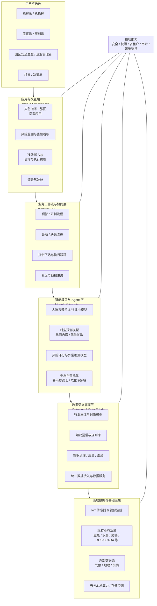
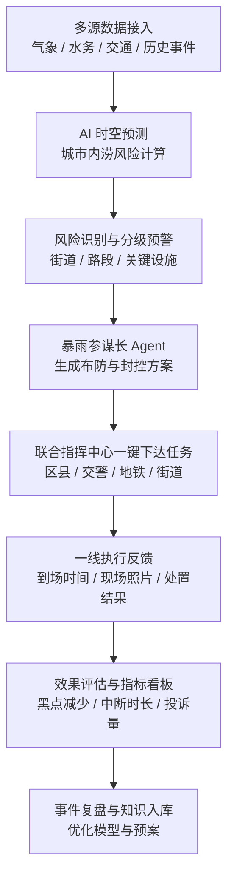
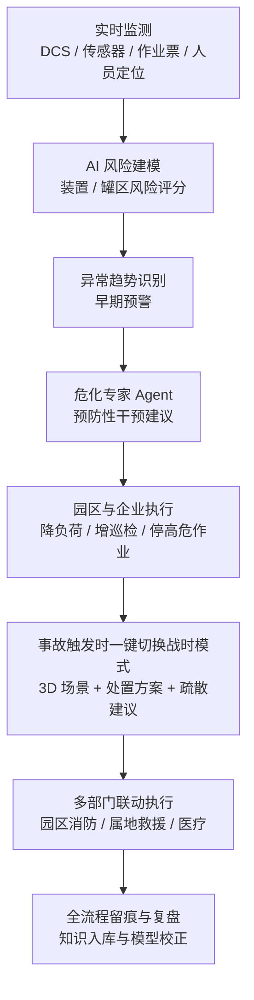
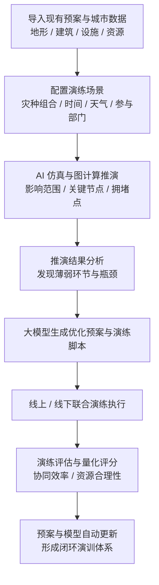
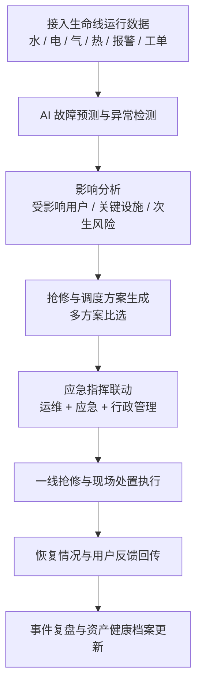
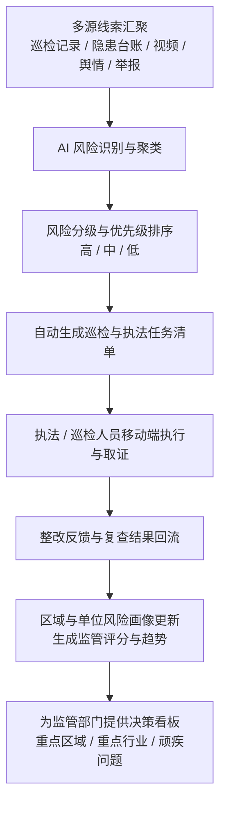

## 一、整体解决方案概述：应急安全 AI 操作系统（Sentinel OS）

### 1. 产品定位

- **产品名称（暂定）**：软通应急安全 AI 操作系统（代号：**Sentinel OS**）。  
- **一句话定义**：  
  **“把分散的应急与安全数据、模型和跨部门协同能力，统一到一个可编排、可推演、可执行、可自我进化的 AI 驱动行业操作系统中。”**
- **产品级别定位**：作为“城市/园区级应急安全的数字基础设施”，类似于“应急安全领域的操作系统 + App Store + 数字专家团队”的综合体。

### 2. 核心设计原则

- **闭环优先**：所有场景必须打通“预测–预警–研判–决策–执行–复盘”的完整闭环，系统天然以 **“闭环 KPI”** 为设计起点。  
- **语义驱动**：以行业本体和对象模型为核心，统一跨系统、跨部门对“人、事、物、风险”的语义理解，实现“机器可理解的应急世界模型”。  
- **Agent 优先 & 可编排**：让一线业务人员可以像搭积木一样，用可视化方式编排 **多 Agent 协同的应急流程**，而非每次重做开发。  
- **自学习与自进化**：每一次事件、演练、险情处置都反哺知识图谱和模型，使系统的“经验值”持续累积，真正做到“越用越懂业务”。  
- **可复制**：以 Ontology 和工作流为基础，使方案可在不同城市、不同园区间快速复制，只做少量本地化调整，构建全国规模化复制能力。

### 3. 总体架构分层

1. **数据语义底座层（Ontology & Data Fabric）**  
   提供统一的数据与语义基础，对标 Palantir 的 Ontology。  
2. **智能模型与 Agent 层（Models & Agents）**  
   通过大模型 + 行业小模型 + 多角色 Agent，支撑研判、预测和决策建议。  
3. **业务工作流与协同层（Workflow OS）**  
   把预警、会商、指令、执行、反馈、复盘等过程编排为可视化工作流，支撑跨部门协同。  
4. **应用与交互层（Apps & Experiences）**  
   面向指挥长、值班员、园区安全总监等不同角色提供 Web 与移动应用。
5. **横切能力**：安全、权限、多租户、审计与监控。

#### 架构示意图

- **文字版结构示意**：  
  用户与角色（指挥长 / 值班员 / 领导 / 安全总监等）  
  → 应用与交互层（指挥应用 / 监测看板 / 移动端 / 领导驾驶舱）  
  → 业务工作流与协同层（预警流程 / 会商流程 / 调度流程 / 复盘流程）  
  → 智能模型与 Agent 层（大模型 / 时空预测模型 / 风险评分模型 / 多角色 Agent）  
  → 数据语义底座层（行业本体 / 对象模型 / 知识图谱 / 数据治理与血缘）  
  → 底层数据与基础设施（IoT 设备 / 业务系统 / 视频平台 / 云与本地算力）  
  （横切能力：安全 / 权限 / 多租户 / 审计 / 运维监控 贯穿各层）

- **Mermaid 架构图代码（可复制到支持 mermaid 的平台中渲染）**：

---

## 二、应急安全行业痛点与机会

### 1. 典型痛点

- **数据割裂与语义不统一**  
  - 气象、视频、IoT 传感器、119/110 接处警、隐患排查、巡检、GIS 等系统彼此独立。  
  - 同一对象（如“危化品罐区”“下凹式立交桥”）在不同系统中的编码、属性不统一，难以形成统一视图。

- **决策高度依赖个人经验**  
  - 暴雨内涝、危化泄漏等复杂情形，需要综合多维数据做研判，但当前更多依赖“老专家”经验。  
  - 新人和轮换人员缺乏经验积累，容易在关键决策时“信息过载+经验不足”。

- **协同响应链条长、不可视**  
  - 多部门协同中，指令多依赖电话、微信群，任务下达与执行情况缺乏结构化记录。  
  - 事件全生命周期难以追踪，更难做量化考核和经验复盘。

- **知识难以沉淀、难以被 AI 利用**  
  - 预案、规章、复盘报告多为文档、PPT 形式，未结构化。  
  - 缺乏统一的“应急知识图谱”，AI 模型无法充分利用这些宝贵经验。

### 2. 机会与趋势

- 国家对“安全生产、风险防控、应急能力现代化”的要求持续提升，应急数智化是长期建设方向。
- 城市与园区的 IoT、视频、业务系统建设相对成熟，具备被“重新组织”的数据基础。
- 大模型、图计算与时空分析技术已经可以支撑复杂行业场景，适合落地到高价值、强刚需的应急安全领域。

---

## 三、AI 驱动的核心场景矩阵（mission‑critical 高价值场景）

本方案围绕“政府应急 + 园区安全”两个主战场，构建 **“2 大旗舰场景 + 3 大延展场景”** 的 AI 驱动场景矩阵，通过多场景组合呈现平台的广度与深度：

### 旗舰场景（深度打透，打造全国标杆）

1. **场景一：城市暴雨内涝智能预警与联合指挥闭环**（政府应急）  
2. **场景二：危化品园区重大风险预警与应急处置闭环**（园区/企业安全）

### 延展场景（增强想象空间，体现平台可扩展性）

3. **场景三：跨灾种城市级“数字演练与推演指挥官”**（多灾种联动推演与预案优化）  
4. **场景四：城市生命线工程故障预测与联动抢修**（水、电、气、热一体化应急）  
5. **场景五：AI 驱动的全域风险巡检与“数字监察官”**（常态化风险扫描与智能执法辅助）

下面优先对两大旗舰场景做深度展开，再对延展场景进行重点描述。

---

## 四、旗舰场景一：城市暴雨内涝智能预警与联合指挥闭环

### 1. 场景概述与战略意义

- **服务对象**：省/市/区应急管理厅局，城市应急指挥中心。  
- **目标事件**：短时强降雨、台风暴雨导致的城市内涝、地铁进水、交通中断等极端气象事件。  
- **战略级定位**：  
  - 是城市应急管理体系中 **“最具可感知度、社会关注度和媒体曝光度”** 的场景之一。  
  - 是最容易在全国形成“标杆示范效应”的旗舰应用，有利于对外讲述城市韧性与数智化治理故事。  
- **目标**：从“气象预报”到“精确到街道/路段的布防与处置”，实现分钟级的智能预警与联合指挥闭环，将系统打造成 **“暴雨战时指挥大脑”**。

### 2. 现状与痛点

- 预警粒度粗，多为“全市/全区”级别，无法指向具体易涝点与关键设施。  
- 泵车、防汛物资预布站位主要依靠经验，常出现“有险无车、有车无险”的错配。  
- 发现险情主要依赖市民投诉和人工巡查，往往已经形成严重积水。  
- 多部门（应急、水务、交警、地铁公司等）响应链路长，缺乏统一事件视图与闭环记录。  
- 事后复盘难以追溯每个关键决策和行动，难以量化评估“预警是否有效”“资源是否用得好”。

### 3. AI 操作系统介入方案

#### 3.1 数据接入与语义建模

- **数据接入**：  
  - 气象：雷达回波、短临预报、降雨格点预报。  
  - 水：雨量站、水位站、河道水情、泵站运行数据。  
  - 城市设施：道路、高架、桥梁、下凹式立交、排水管网、地铁出入口。  
  - 历史事件：历年内涝点、积水深度、处置记录、损失情况。  
  - 实时交通与投诉数据：路况、路段封闭、报警与投诉。

- **Ontology 统一建模**：  
  - 实体：雨量格点、道路、桥梁、下凹立交、管网、泵站、地铁站、医院、学校等关键资产。  
  - 关系：雨–地形–排水–道路–重点设施的时空关联。  
  - 所有实体与关系形成“城市暴雨风险知识图谱”。

#### 3.2 智能研判与推演

- 构建 **城市内涝时空预测模型**：  
  - 基于实时和预测降雨 + 地形 + 排水能力，预估未来 1–3 小时的积水点位置与深度。  
  - 支持以街道、路段、社区为单位输出风险等级。
- 建立 **关键资产影响分析模型**：  
  - 自动计算未来一段时间内，可能受内涝影响的地铁站、医院、变电站、交通枢纽数量和重要程度。

#### 3.3 AI Agent 与工作流

- **“暴雨参谋长 Agent”**：  
  - 自动读取 Ontology 中的城市基础设施与历史内涝数据。  
  - 根据内涝预测结果自动生成：  
    - 分区域预警建议（哪些区域建议发布红/橙/黄预警）。  
    - 泵车与应急队伍预布站位方案（考虑道路通行、历史响应效果）。  
    - 需提前封闭或警戒的下凹立交、地铁出入口等。

- **工作流编排示例**：  
  - 规则：当某区域未来 1 小时内预测积水深度 > 某阈值 且 涉及关键设施数量 ≥ N →  
    1. 自动生成风险研判报告草稿。  
    2. 推送给值班长确认，确认后：  
       - 自动下发预布防任务至区县/街道。  
       - 向交警和地铁部门推送封路与站点调控建议。  
    3. 通过移动端采集执行反馈（抵达时间、现场照片、实际积水情况）。

### 4. 闭环链路

1. **预测**：系统实时生成未来 1–3 小时城市内涝风险图。  
2. **预警**：对高风险路段、关键基础设施自动触发预警并给出原因。  
3. **决策建议**：暴雨 Agent 生成预布防与封控建议。  
4. **指令下达**：通过工作流引擎，一键下达任务至相关部门与区县。  
5. **执行反馈**：各执行单位通过 App 回传执行状态和现场信息。  
6. **效果评估**：对比预测与实测积水点、投诉量、交通中断时长等，自动生成评估结论。  
7. **复盘与知识沉淀**：全程时序与关键决策入库，自动生成“数字战报”与复盘报告，反馈给知识与模型。

#### 流程图（示意）

- **流程示意**：  
  多源数据接入（气象 / 水务 / 交通 / 历史事件）——通过标准接口、消息总线和数据同步任务对接现有业务系统与传感器平台  
  → AI 时空预测（城市内涝风险计算）——基于时空预测模型与地形/管网参数，在计算集群中实时滚动预测  
  → 风险识别与分级预警（街道 / 路段 / 关键设施）——在规则引擎与阈值配置中心中自动判级并触发预警事件  
  → 暴雨参谋长 Agent 生成布防与封控方案——由大模型 + 规则库 + 历史案例库联合推理生成多方案建议  
  → 联合指挥中心一键下达任务（区县 / 交警 / 地铁 / 街道）——通过工作流引擎编排指令，推送至 Web 指挥端和移动端 App  
  → 一线执行反馈（到场时间 / 现场照片 / 处置结果）——通过移动端表单、定位与拍照上传功能实时回传执行状态  
  → 效果评估与指标看板（黑点减少 / 中断时长 / 投诉量）——利用指标计算引擎生成 KPI，并在可视化大屏/驾驶舱中展示  
  → 事件复盘与知识入库（优化模型与预案）——自动归档时序数据和关键决策，写入知识图谱与模型训练数据集

- **Mermaid 流程图代码（可复制到支持 mermaid 的平台中渲染）**：

  

### 5. AI 带来的价值指标

- **效率↑**：  
  - 暴雨风险研判时间：从 1–2 小时人工汇总 → **5–10 分钟自动研判**（效率提升 6–12 倍）。  
  - 预布防决策时间：从 30–60 分钟多轮沟通 → **5 分钟内形成方案并下达指令**。

- **风险↓**：  
  - 严重内涝黑点数量：**预计减少 30–50%**。  
  - 与暴雨相关的交通中断时长：**减少 20–40%**。  
  - 关键设施（医院、变电站等）因内涝受损事件数：力争 **接近 0**。

- **成本↓ / 收益↑**：  
  - 泵车与应急队伍利用率提升 20–30%，减少无效出动。  
  - 城市年度因内涝导致的直接经济损失，**预计下降 10–20%**。  
  - 为城市在抗灾能力评估、信用评级、营商环境评价中加分。
  - 通过标准化能力沉淀与复制，降低后续城市部署的 **边际建设成本 30% 以上**。

### 6. AI 驱动能力亮点小结

- **多模态时空 AI**：同时理解“时间序列 + 空间地理 + 结构化业务数据 + 文本预案”。  
- **多 Agent 协同**：暴雨参谋长 Agent + 道路交通 Agent + 地铁安全 Agent 联合输出“一致、不冲突”的处置方案。  
- **自学习能力**：通过每一次降雨事件和演练结果，对模型进行在线再训练，自动修正参数与规则，使系统对本城地形与排水特性越来越“熟悉”。

---

## 五、旗舰场景二：危化品园区重大风险预警与应急处置闭环

### 1. 场景概述与战略意义

- **服务对象**：大型危化品园区、化工企业集团及其上级安全监管部门。  
- **目标事件**：危化品泄漏、火灾、爆炸等对生命安全、生态环境和产业链安全影响极大的事故。  
- **战略级定位**：  
  - 是关系到“城市安全、产业安全、供应链安全”的关键场景，和地方政府与央企的安全责任高度绑定。  
  - 危化园区属于国家重点监管对象，一旦打造成功标杆，极易形成 **“园区群 + 企业集团”级别的规模复制效应**。  
- **目标**：从“事后事故处置”升级为“事前风险预防 + 事中精准处置 + 事后复盘优化”的闭环管理，把系统打造成园区的 **“数字安全总监 + 数字首席风险官（CRO）”**。

### 2. 现状与痛点

- 安全巡检与隐患排查以人工为主，记录分散，难以动态评估整体风险。  
- DCS（Distributed Control System，分布式控制系统）/SCADA、在线监测、视频、人员定位等系统彼此独立，没有统一的装置/罐区风险视图。  
- 重大危险源风险评估周期长，多为年度/季度评估，缺乏实时动态更新。  
- 事故发生后，指挥部在短时间内难以综合“物料信息 + 工艺流程 + 周边环境 + 风向人口”进行决策。

### 3. AI 操作系统介入方案

#### 3.1 数据与语义建模

- **数据接入**：  
  - 工艺与设备：工艺流程、设备台账、在线监测（温度、压力、液位、可燃/有毒气体）、DCS/SCADA 报警。  
  - 作业与人员：作业票证系统（动火、受限空间、高处等）、视频监控、人员定位。  
  - 环境与气象：风向、风速、温度、湿度。  
  - 历史：历史事故与未遂事件、隐患记录、整改情况。

- **Ontology 建模**：  
  - 实体：装置单元、储罐、阀门、管道、物料、作业票、作业人员、传感器、风向/风速、事故案例。  
  - 关系：物料–设备–工艺–空间位置–作业活动 的全链路关系。  
  - 形成“危化安全知识图谱”，为后续 AI 分析与推演提供基础。

#### 3.2 风险预测与异常识别

- **设备异常早期识别模型**：  
  - 针对压力、温度、振动、泄漏检测等时间序列，识别“缓慢漂移”“异常波动”等早期征兆。  
  - 在还未触发传统硬阈值报警前就给出“早期告警”。

- **作业风险评分模型**：  
  - 结合作业类型、作业时间、作业地点所处装置风险等级、物料性质、天气条件等维度，对每次作业进行风险评分。  
  - 高风险作业自动关联额外审批或监护要求。

- **实时风险地图**：  
  - 对每个装置/罐区给出当前风险等级及变化趋势，显示在园区风险地图中。

#### 3.3 危化专家 Agent 与处置工作流

- **“危化专家 Agent”**：  
  - 在检测到某装置/罐区风险显著上升时，基于本体与历史事故库推断可能的事故类型与发展路径。  
  - 自动生成建议处置清单：包括操作步骤（关闭哪些阀门/切断何种供给）、需要调动的资源、推荐疏散范围等。

- **工作流示例**：  
  - 当某罐区风险评分超过阈值：  
    1. 自动触发“预防性干预流程”（减少负荷、增加巡检频率、暂停高风险作业）。  
    2. 通知安全总监和值班长，给出原因解释与建议动作。  
  - 一旦事故真实发生：  
    1. 自动弹出 3D 场景，展示事故点装置、物料、周边敏感目标。  
    2. 危化 Agent 给出应急处置步骤、下风向影响范围、疏散建议。  
    3. 一键联动园区消防、属地救援力量与医疗机构。

### 4. 闭环链路

1. **实时监测与风险评分**：所有关键装置/罐区风险评分与趋势一屏可见。  
2. **早期预警**：对尚未触发传统报警阈值的异常趋势进行提示。  
3. **预防性干预**：启动针对性的操作，降低事故发生概率。  
4. **事故时精准应急**：在事故发生时迅速形成“态势–建议–指令”一体化决策支持。  
5. **处置执行闭环**：处置过程关键节点结构化记录，任务闭环可追溯。  
6. **复盘与优化**：自动生成事故复盘报告，将新的经验纳入知识图谱与模型，不断优化预警策略。

#### 流程图（示意）

- **流程示意**：  
  实时监测（DCS：Distributed Control System，分布式控制系统 / 传感器 / 作业票 / 人员定位）——通过工业协议网关与企业现有系统对接，统一接入到数据总线  
  → AI 风险建模（装置 / 罐区风险评分）——在图谱上叠加多维特征，使用风险评分模型按装置/罐区实时打分  
  → 异常趋势识别与早期预警——通过时间序列异常检测服务识别缓慢漂移与异常波动，并在告警中心生成早期预警  
  → 危化专家 Agent 生成预防性干预建议——由专家规则 + 历史事故库 + 大模型对风险进行场景化推理，输出可执行建议清单  
  → 园区与企业执行（降负荷 / 增巡检 / 停高危作业）——通过园区调度控制台和班组移动端，将措施下发至具体岗位与设备  
  → 事故触发时一键切换战时模式（3D 场景 + 处置方案 + 疏散建议）——调用三维可视化引擎与事故推演模块，自动切换到应急态势界面  
  → 多部门联动执行（园区消防 / 属地救援 / 医疗）——通过跨单位协同工作流和对接现有通信/指挥系统实现联动调度  
  → 全流程留痕与复盘（知识入库与模型校正）——将所有操作与传感器数据写入事件时间线，并定期用于模型再训练与知识库更新

- **Mermaid 流程图代码（可复制到支持 mermaid 的平台中渲染）**：

### 5. AI 带来的价值指标

- **风险↓**：  
  - 重大事故发生概率：预计降低 **30–60%**。  
  - 高风险作业“带病作业”比例：降低 **50% 以上**。  
  - 群死群伤和大面积爆炸类恶性事故：目标是 **0 起**。

- **效率↑ / 成本↓**：  
  - 安全巡检效率：通过智能路线规划与自动记录，人均巡检效率提升 **30–40%**。  
  - 事故处置决策时间：从传统 20–30 分钟信息汇总 → **3–5 分钟内形成方案**。  
  - 园区整体事故损失和保险支出：中长期看有望 **下降 20–30%**。

- **收益↑**：  
  - 安全水平提升带来更好的政策资源、融资信用评级与合作伙伴信任。  
  - 可衍生“安全托管服务”等新业务模式，形成经常性服务收入。

### 6. AI 驱动能力亮点小结

- **物理世界 + 业务世界的统一建模**：把罐、管、阀、物料、作业、人员、环境等全要素映射到一张图谱上，供 AI 进行复杂推理。  
- **细粒度预测性维护与风险预警**：通过时间序列建模和图神经网络等方法，识别“肉眼看不到的风险趋势”。  
- **知识增强型 Agent**：将专家多年经验结构化后，作为大模型推理的“外挂知识库”，既会“算”，又懂“经验”与“合规”。

---

## 六、延展场景：体现平台扩展能力与想象空间

### 场景三：跨灾种城市级“数字演练与推演指挥官”

#### 1. 场景概述

- 覆盖地震、暴雨内涝、山洪、地质灾害、危化事故等多灾种，基于统一城市数字孪生底座，构建 **“一城一盘棋”的虚拟推演环境**。  
- 支持“真预案、真地形、真资源、真流程”的沙盘推演与联合演练，成为城市应急的 **数字演训场**。

#### 2. AI 驱动能力

- 利用图计算和仿真模型，对不同灾种叠加情况下的影响范围、关键节点失效、救援路径拥堵等进行快速推演。  
- 通过大模型 + 规则引擎，自动生成不同场景下的处置脚本与演练方案，减少人工编制预案和演练剧本的工作量。  
- 基于每次演练结果，自动评估部门协同效率、资源配置合理性，并给出优化建议，实现 **“预案自动体检与智能迭代”**。

#### 3. 价值与指标

- 城市级综合演练筹备周期：从传统的数月缩短到 **数周甚至数天**。  
- 预案覆盖的风险情景数：通过自动推演，**可扩展到人工难以穷举的组合场景**。  
- 各部门在复杂灾情下的协同演练次数与质量显著提升，可作为城市“韧性评分”的核心支撑指标。

#### 4. 场景流程图（示意）

- **流程示意**：  
  导入现有预案与城市数据（地形 / 建筑 / 设施 / 资源）——通过数据集成与文档解析，将预案文本和空间数据结构化入库  
  → 配置演练场景（灾种组合 / 时间 / 天气 / 参与部门）——在演练配置界面中由业务人员可视化勾选和参数化配置  
  → AI 仿真与图计算推演（影响范围 / 关键节点 / 拥堵点）——调用仿真引擎与图计算服务，对不同灾种组合进行批量推演  
  → 推演结果分析（发现薄弱环节与瓶颈）——在分析视图中叠加多轮推演结果，自动标出高风险节点与协同瓶颈  
  → 大模型生成优化预案与演练脚本——利用大模型对推演结果和现有预案进行重写与补强，生成可直接用于演练的脚本  
  → 线上 / 线下联合演练执行——通过系统下发演练步骤与任务，结合现场实操与线上推演同步推进  
  → 演练评估与量化评分（协同效率 / 资源合理性）——基于任务完成时序和资源调用记录自动生成评分与分析报告  
  → 预案与模型自动更新（形成闭环演训体系）——将评估结果回写预案库和模型参数，形成持续迭代的演训闭环

- **Mermaid 流程图代码（可复制到支持 mermaid 的平台中渲染）**：

---

### 场景四：城市生命线工程故障预测与联动抢修

#### 1. 场景概述

- 聚焦城市水、电、气、热等生命线工程，构建一张统一的 **“城市生命线风险态势图”**。  
- 将应急与行业运行结合，实现“运行业务 + 应急处置”的一体化。

#### 2. AI 驱动能力

- 利用时间序列异常检测、剩余寿命预测（RUL）等模型，对管网泄漏、设备老化、负荷异常进行 **提前预测**。  
- 在检测到故障风险后，自动推演可能影响的用户规模、关键设施，并生成多方案抢修路径与物资调配建议。  
- 与应急工作流联动，在故障升级为突发事件前启动预案，实现 **“从运维到应急的无缝衔接”**。

#### 3. 价值与指标

- 重大停水、停电、停气事件发生次数：**显著下降**。  
- 故障平均恢复时间（MTTR）：预计缩短 **20–40%**。  
- 生命线工程突发故障引发的次生灾害（如燃气爆炸、二次内涝）的概率明显降低。

#### 4. 场景流程图（示意）

- **流程示意**：  
  接入生命线运行数据（水 / 电 / 气 / 热 / 报警 / 工单）——通过专线、网关与 API 对接运行监控系统与工单系统  
  → AI 故障预测与异常检测——在时序预测与异常检测服务中对关键设备和管网进行持续“体检”  
  → 影响分析（受影响用户 / 关键设施 / 次生风险）——结合 GIS 与资产图谱，计算潜在影响范围与关键用户  
  → 抢修与调度方案生成（多方案比选）——利用路径规划和资源约束算法自动生成多套抢修方案供指挥选择  
  → 应急指挥联动（运维 + 应急 + 行政管理）——通过统一指挥界面和跨部门工作流，将方案同步到相关部门  
  → 一线抢修与现场处置执行——抢修人员通过移动端获取工单、导航和安全提示，并实时回报进展  
  → 恢复情况与用户反馈回传——系统自动监测指标恢复情况，同时接收用户报修关闭与满意度回访数据  
  → 事件复盘与资产健康档案更新——将本次事件记录到资产生命周期档案，用于后续检修策略与投资决策优化

- **Mermaid 流程图代码（可复制到支持 mermaid 的平台中渲染）**：

---

### 场景五：AI 驱动的全域风险巡检与“数字监察官”

#### 1. 场景概述

- 将日常巡检、隐患排查、舆情线索、群众举报、视频巡查等统一纳入一个 **“全域风险雷达系统”**。  
- 为应急、安全、住建、城管等多部门提供一个 **数字化“监察官”**，实现常态化风险扫描与智能执法辅助。

#### 2. AI 驱动能力

- 利用视频智能识别发现占用疏散通道、违规堆放危化物、明火作业等显性风险。  
- 利用文本大模型对举报、舆情、检查记录进行聚类和风险分级，自动识别“重复发生的顽疾”和潜在系统性风险。  
- 自动生成巡检路线与任务清单，并根据历史整改效果动态调整重点区域和频次。

#### 3. 价值与指标

- 巡检人均覆盖点位数提升 **50% 以上**，但一线工作负荷更可控。  
- 重大隐患被发现并整改的提前量明显提升，**“带病运行”时间显著缩短**。  
- 为监管部门提供量化的“日常监管有效性”指标，提升监管威慑力与公信力。

#### 4. 场景流程图（示意）

- **流程示意**：  
  多源线索汇聚（巡检记录 / 隐患台账 / 视频 / 舆情 / 举报）——通过数据汇聚平台与爬虫/接口，将多渠道线索统一到风险中心  
  → AI 风险识别与聚类——利用 NLP、图像识别与聚类算法，对线索进行自动分类与相似事件聚合  
  → 风险分级与优先级排序（高 / 中 / 低）——结合法规规则、历史处置结果和区域权重自动打分并排序  
  → 自动生成巡检与执法任务清单——按辖区和职能将任务拆分下发到具体单位和责任人  
  → 执法 / 巡检人员移动端执行与取证——通过移动执法 App 支持定位、拍照、录音录像和在线填写文书  
  → 整改反馈与复查结果回流——企业在线提交整改材料，监管部门现场或非现场复查并在系统中闭环  
  → 区域与单位风险画像更新（生成监管评分与趋势）——基于历史隐患、整改时效与重复问题自动更新“风险画像”  
  → 为监管部门提供决策看板（重点区域 / 重点行业 / 顽疾问题）——在领导驾驶舱中展示高风险区域、行业和企业清单，辅助年度监管计划制定

- **Mermaid 流程图代码（可复制到支持 mermaid 的平台中渲染）**：

---

## 七、技术竞争力体现（对标 Palantir）

### A. 数据语义底座（类似 Palantir Ontology）

- **行业本体库、对象模型、语义对齐**：  
  - 针对“城市应急”“危化安全”分别构建行业本体库，将城市设施、应急资源、危化装置、作业活动等统一建模。  
  - 支撑跨系统的语义对齐，让不同来源数据在一个统一的语义空间中可被理解和计算。

- **异构数据自动建模、治理、血缘、质量**：  
  - 支持自动识别数据源 schema，利用语义匹配与规则引擎做字段对齐与清洗。  
  - 内置数据质量规则（完整性、一致性、时效性），并记录数据血缘，确保应急决策可追溯、可信赖。

- **业务知识结构化 → 支撑模型推理与应用快速构建**：  
  - 将预案、规程、复盘报告等文本转化为结构化的规则、流程与图谱。  
  - 为大模型与专用小模型提供高质量的“知识燃料”，缩短从“业务经验”到“AI 能力”的距离。

### B. 智能模型与 Agent 编排能力

- **多模态时空分析**：统一处理文本、时间序列、空间数据、图像与视频。  
- **可插拔模型架构**：可引入第三方模型（气象模型、CFD 模型等），通过 Ontology 与工作流无缝对接。  
- **Agent 编排**：为“值班长、研判员、安全总监”等不同角色定义对应 Agent，支持多 Agent 协同完成复杂任务。

### C. 工作流与低代码场景构建

- 内置可视化工作流编排器：把预警、会商、任务分派、督办、复盘变成可配置流程。  
- 业务部门可自行调整流程、增加节点，而无需每次委托厂商开发，**将场景上线周期从数月缩短到数天/数周**。

### D. 安全、合规与部署能力

- 支持政府内网、企业专网部署，满足等保与国密要求。  
- 精细化的权限控制与操作审计，满足多部门协同与监管要求。  
- 多租户架构，可同时服务城市、园区、企业多层级用户。

---

## 八、Demo & Use Case 设计（对外展示）

### 1. Demo 场景一：城市暴雨内涝指挥 Demo

- **故事线简述**：  
  1. 展示未来 3 小时降雨和内涝风险热力图。  
  2. 暴雨参谋长 Agent 提示某区若干下凹立交风险突出。  
  3. 系统自动给出泵车布防与封路建议，指挥长一键下达。  
  4. 实时更新现场执行反馈与路况变化。  
  5. 结束后，一键生成“战报”和复盘摘要。

- **演示要点**：  
  - 突出“从预测到行动”的闭环能力。  
  - 展示 Agent 与指挥长之间的自然语言交互。  
  - 展示时间线与复盘报告自动生成能力。

### 2. Demo 场景二：危化园区风险地图与事故处置 Demo

- **故事线简述**：  
  1. 展示园区实时风险地图与各装置风险评分。  
  2. 某储罐出现异常趋势，系统发出早期预警。  
  3. 危化 Agent 生成预防性干预建议并下达执行。  
  4. 模拟事故发生，系统展示 3D 场景、下风向影响与处置建议。  
  5. 最终自动生成事故复盘报告与优化建议。

- **演示要点**：  
  - 强调实时风险评分与早期告警能力。  
  - 强调知识图谱与历史案例驱动的专家级决策支持。  
  - 强调闭环追踪与持续优化。

---

## 九、实施路径与商业模式

### 1. 实施路径

- **阶段一：标杆试点（0–12 个月）**  
  - 选择 1–2 个城市 + 1–2 个危化园区作为试点。  
  - 完成数据底座搭建、2 大闭环场景落地与 Demo 打磨。  
  - 形成标准化实施方法论和可对外宣传的成功案例。

- **阶段二：规模复制（12–36 个月）**  
  - 以“城市应急 + 园区安全”双轮驱动复制到更多省市与园区。  
  - 收费模式从项目制逐步转向 **平台订阅 + 場景包收费**。

- **阶段三：平台生态与数据服务（36 个月以后）**  
  - 开放平台给第三方模型和服务商，建设行业生态。  
  - 探索基于风险数据的增值服务，如安全托管服务、风险定价咨询等。

### 2. 商业模式设计

- **平台订阅费**：应急安全操作系统年度使用费。  
- **场景包收费**：按暴雨内涝、危化安全、地质灾害等场景销售模块。  
- **增值服务**：应急演练、风险评估、数据分析报告、安全托管等服务。

---

## 十、对投资人的价值与故事主线

- **高价值刚需入口**：应急安全领域是“生命安全 + 财产安全”的刚需，预算稳定，决策层级高。  
- **Palantir 式技术护城河**：以行业本体、语义数据底座和知识结构化能力为核心，形成难以复制的行业数据与知识资产。  
- **从项目公司到平台公司**：通过平台订阅与场景包，形成可持续、可扩展的收入结构。  
- **可扩展行业边界**：在应急安全中沉淀的 Ontology、工作流与 Agent 架构，可复制到城市运行、公共安全、能源等更多行业。

---

## 十一、总结

通过构建对标 Palantir 的应急安全 AI 操作系统，本方案以 **“数据语义底座 + 智能 Agent + 业务工作流”** 为核心，围绕“城市暴雨内涝”和“危化园区安全”两个 mission‑critical 高价值场景，完整展示了从数据整合、智能研判到行动闭环和持续优化的产品能力与商业潜力，可作为公司对外宣传、投资人路演以及标杆项目拓展的统一方案基线。

