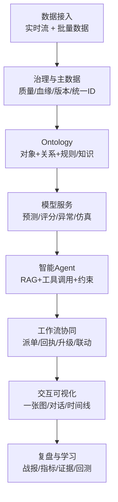
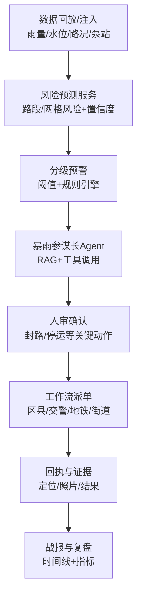

## V6：两大 Demo 深化设计（行业知识 + Ontology + Agent + Workflow）

本文件将两个 Demo 从“演示脚本”深化为可落地的 **设计思路与技术设计流程**，核心范式为：

> **数据语义底座（Ontology） + 智能 Agent（LLM/RAG/工具调用） + 业务工作流（Workflow OS）**  
> 用行业知识（预案/规程/MSDS/法规/历史案例）把 AI 约束成“可解释、可执行、可审计”的行动闭环。

---

## 0. 统一设计方法（两大 Demo 共用）

### 0.1 业务闭环的最小切分

- **态势（Sense）**：多源数据 → 对象状态（道路/泵站/储罐/作业票…）  
- **研判（Think）**：模型输出 风险/影响/置信度/解释  
- **决策（Decide）**：Agent 基于知识与实时态势生成 方案 + 结构化任务包  
- **执行（Act）**：工作流下发任务到人/部门/系统并追踪回执  
- **复盘（Learn）**：时间线 + 指标 + 证据归档，反哺规则/知识/模型

### 0.2 Ontology（数据语义底座）怎么做“行业化”

- **对象先行**：先定义关键对象（城市设施/应急资源/危化装置/物料/作业/人员），再定义关键关系（空间/拓扑/影响/任务归属）。  
- **知识入库**：把预案条款、处置规程、法规约束、MSDS/物料知识、历史案例，结构化为“触发条件→建议动作→依据”。  
- **可追溯**：每条建议必须能追溯到“数据版本 + 模型版本 + 规则/知识版本”。

### 0.3 Agent（智能体）怎么“可控可信”

- **RAG**：检索预案/规程/MSDS/案例 + 实时态势（Ontology 查询结果），再生成建议。  
- **工具调用**：Agent 通过工具完成结构化动作（查询 TopN 风险、生成任务单、触发流程、生成纪要），避免自由发挥。  
- **强约束输出**：自然语言解释 + 结构化任务包 + 依据引用（条款/案例/数据证据）。  
- **人审机制**：封路/停运/疏散/停产等高风险动作必须“人审确认”。

### 0.4 Workflow（业务工作流）怎么“闭环可验收”

- **任务状态机**：待接收→已接收→执行中→已完成/退回；支持超时升级、催办、转派。  
- **事件任务网**：同一事件下任务与对象/区域绑定，形成统一态势与进度视图。  
- **时间线与证据**：操作、指令、回执、证据材料自动归档，支持复盘与审计。

---

## 1. 通用技术设计流程图

### 1.1 文字版

数据接入（流+批）  
→ 数据治理/主数据（质量/血缘/版本/统一ID）  
→ Ontology（对象+关系+规则/知识）  
→ 模型服务（预测/评分/异常/仿真）  
→ Agent（RAG+工具调用+约束）  
→ 工作流（派单/协同/回执/升级/联动）  
→ 可视化与交互（一张图/对话/时间线）  
→ 复盘学习（战报/指标/证据/回测）

### 1.2 Mermaid（可复制渲染）



### 1.3 通用技术方案（更细：数据“流转/转换” + Ontology + ModelOps + Agent + Workflow）

> 你提到的“数据怎么扭转”，在工程上通常指 **数据如何流转与转换**：从源系统/设备 → 标准化 → 主数据映射 → 语义对象 → 特征/模型 → Agent 方案 → 工作流执行 → 复盘回写 的端到端链路。本节把每一步写成可落地方案。

#### 1.3.1 数据接入（Source → Ingest）

- **接入对象分类**：  
  - **实时流**：雨量/水位/路况、DCS/SCADA 测点、气体浓度、人员定位、报警事件  
  - **准实时/批**：设施台账、园区设备台账、预案/规程文档、历史事件、MSDS、组织架构/责任体系
- **接入方式**（可按现网选型）：  
  - **API 拉取**：定时拉取 + 增量游标（`updated_at` / `since_id`）  
  - **消息推送**：源系统推送事件到消息总线（推荐，用于端到端时延可控）  
  - **文件落地**：Excel/CSV/PDF/Word 上传（用于 Demo 或早期快速落地）
- **统一事件封装（通用事件结构）**：所有实时数据统一包装为事件（event），至少包含：  
  - `source_system`（来源系统）  
  - `event_type`（雨量/水位/报警/测点…）  
  - `event_time`（事件发生时间）  
  - `ingest_time`（接入时间）  
  - `object_ref`（关联对象：road_id/tank_id/sensor_id…）  
  - `payload`（原始值/单位/质量标记）
- **事件时间（event time）处理**：  
  - 允许乱序/延迟到达；按 `event_time` 做窗口计算；超出允许迟到阈值进入“修正通道”，触发指标回补与解释提示（例如“数据延迟导致置信度下降”）。

#### 1.3.2 数据标准化与转换（Ingest → Standardize → MDM → Semanticize）

- **三段式转换**：  
  1) **标准化（Standardize）**：单位换算、字段对齐、坐标系统一、枚举归一、缺失/异常标记  
  2) **主数据映射（MDM Map）**：把源系统编码映射到平台统一对象 ID（跨系统同一对象归一）  
  3) **语义化（Semanticize）**：落到 Ontology 对象模型（对象属性 + 关系边），形成“机器可理解的行业世界”
- **强制规则**：  
  - **单位与量纲统一**：雨量（mm/h）、水位（m）、压力（kPa/MPa）、浓度（ppm/%LEL）统一到平台标准  
  - **空间统一**：统一坐标系；道路/区域/网格建立多层空间索引（行政区→网格→路段/点位）  
  - **质量标签（DQ Tag）**：对每条数据打 `freshness/accuracy/completeness` 标签，模型与 Agent 可引用

#### 1.3.3 数据存储分层与数据服务（Raw/ODS/Ontology/TSDB）

- **Raw 原始层**：保留源字段与原始载荷（审计/复盘/模型回放）  
- **ODS 标准层**：字段/单位/坐标统一后的事实表（大多数查询与计算基座）  
- **Ontology 语义层**：  
  - **Entity（对象表）**：道路/泵站/储罐/物料/作业票/人员/任务…  
  - **Edge（关系表）**：`contains/monitors/locatedIn/serves/targets/affects` 等  
  - **Knowledge（知识表）**：条款、阈值、处置步骤、禁忌与约束
- **TSDB 时序层**：高频测点（雨量/水位/温压液位/浓度）按传感器维度存储，支持趋势与窗口聚合  
- **对外数据服务（统一 Data API）**：  
  - `get_object_state(object_id)`（对象状态快照）  
  - `query_objects(filter)`（按区域/类型/风险筛选对象）  
  - `query_relations(object_id, relation_type)`（对象关系展开）  
  - `query_timeseries(sensor_id, range, agg)`（趋势与窗口聚合）  
  - `get_incident_timeline(incident_id)`（事件时间线）

#### 1.3.4 特征工程与特征服务（Feature Store：ODS/TSDB/Graph → Features）

- **两条链路**：  
  - **离线特征**：训练/回测（历史重放）  
  - **在线特征**：实时推理（与离线同口径）
- **典型特征（举例）**：  
  - 暴雨：近 5/15/60 分钟雨强、累计雨量、上游水位梯度、道路低洼度、排水能力、历史黑点次数  
  - 危化：温压液位趋势斜率、多变量相关性、作业票状态、人员密度、风向风速、物料危险性向量
- **一致性要求**：在线与离线共享同一套特征定义与口径（避免训练/推理偏差）

#### 1.3.5 模型训练/回测/推理（ModelOps）

- **模型类型建议（可插拔）**：  
  - 时空预测：网格/路段风险预测（输出置信度/不确定性）  
  - 风险评分：装置/罐区风险等级与趋势  
  - 异常检测：缓慢漂移、关联异常、工况切换识别  
  - 影响范围：快速近似 + 精细推演（可选）
- **回测评价指标**：命中率、提前量、误报/漏报、空间偏差；评价结果写入模型评估表用于版本准入  
- **推理输出规范**：必须包含 `score/value`、`confidence`、`explain_factors[]`、`model_version`

#### 1.3.6 Agent（RAG + Tools）工程实现

- **知识库构建**：  
  - 文档类（预案/规程/法规/MSDS/案例）→ 分段切片 → 向量索引 + 结构化索引（条款号/章节/对象类型）  
  - 结构化知识（阈值/禁忌/处置步骤）→ Knowledge 表（硬约束）
- **检索策略（RAG）**：先按对象/事件类型过滤，再语义检索；证据不足必须返回“需要补充的数据清单”  
- **工具调用**：Agent 只调用白名单工具；工具返回结构化结果；Agent 组织为“解释 + 任务包 + 依据引用”  
- **高风险动作控制**：封路/停运/疏散/停产 → 必须走审批节点（人审确认）

#### 1.3.7 工作流引擎（Workflow OS）工程实现

- **流程模板**：按事件类型配置节点/条件/角色/时限/证据要求  
- **任务 Schema（建议固化）**：`task_id, incident_id, target_object_id, owner_org, assignee, SLA, status, required_evidence, created_at, updated_at`  
- **协同机制**：任务分组、超时升级（催办→转派→上报）、回执标准化（照片/视频/定位/表单字段）  
- **事件时间线**：自动串联“模型输出/Agent 建议/人审/派单/回执/关闭”，支持战报一键生成

#### 1.3.8 安全/权限/审计/可观测（必须写入技术方案）

- **权限模型**：RBAC（岗位）+ ABAC（区域/对象级）  
- **审计留痕**：关键操作全留痕；建议可追溯到数据/模型/知识版本  
- **可观测**：日志/指标/链路追踪；关键链路 SLO（预警→派单端到端延迟）可监控

---

## 2. Demo 一：城市暴雨内涝指挥（深入细化）

### 2.1 Demo 故事线（对外讲解）

1) 风险热力图滚动更新（未来 1–3 小时）  
2) 暴雨参谋长 Agent 主动提示 TopN 高风险点位（含原因与置信度）  
3) 一键生成“布防/封控/联动”任务包并下发（区县/交警/地铁/街道）  
4) 移动端回执与现场证据回传，指挥端实时显示进度  
5) 一键生成战报（时间线 + 指标 + 依据）

### 2.2 行业知识素材（Demo 必须准备）

- **预案与规程**：暴雨内涝应急预案、道路封控标准、地铁停运/限流规则、泵站启停与巡检规程  
- **对象清单**：易涝点清单、重点保障目标清单（医院/变电站/地铁站/交通枢纽）  
- **分级策略**：黄/橙/红预警阈值；积水深度阈值；封控触发条件（可配置）

### 2.3 Ontology（最小可用对象模型）

- **实体**：`RainGrid`、`RainGauge`、`WaterLevelStation`、`RoadSegment`、`Underpass`、`PumpStation`、`MetroEntrance`、`CriticalAsset`、`ResponseTeam`、`PumpTruck`、`Task`、`Incident`  
- **关系**：空间归属/邻近、服务范围、影响传播、任务目标、事件任务网等  
- **关键字段（示例）**：  
  - `RoadSegment`: road_id, geometry, admin_area, elevation, drainage_capacity  
  - `Underpass`: underpass_id, depth_threshold, linked_road_id  
  - `Task`: task_id, target_object_id, owner_org, SLA, evidence_required

### 2.4 数据设计（可重复演示的回放+注入）

- **回放数据**：历史暴雨（分钟级雨量/雷达）、水位、泵站运行、路况、历史内涝点  
- **异常注入**：雨强突增/泵站故障/道路拥堵（按时间轴注入，制造“决策拐点”）  
- **数据可信度提示**：延迟/缺失时在 UI 显示“数据新鲜度/置信度下降”，体现工程可靠性

### 2.5 模型与服务（Demo 版也要“工程化”）

- **时空预测服务**：输出网格/路段风险值（含置信度）  
- **影响分析服务**：输出受影响关键设施 TopN、建议优先级  
- **可解释输出**：贡献因子（雨强、地形低洼、排水能力、历史黑点）

### 2.6 Agent 设计（暴雨参谋长：RAG + 工具调用）

- **RAG 证据源**：预案条款、封路规则、地铁调控规则、历史案例战报  
- **工具（示例）**：  
  - `query_risk_topn(area, n)`  
  - `query_assets_at_risk(area)`  
  - `create_task_pack(plan)`  
  - `trigger_workflow(flow_id, task_pack)`  
  - `draft_briefing()`  
- **强制输出结构**：解释 + 任务包 + 引用依据（条款/数据）

### 2.7 工作流（暴雨处置闭环）

- **节点**：预警触发 → 研判确认（人审） → 方案生成 → 派单 → 回执/证据 → 评估 → 战报  
- **状态机**：超时升级（催办/转派）；关键动作（封路/停运）必须二次确认

### 2.8 UI 设计（Demo 页面建议）

- 指挥一张图（风险/资源/任务）+ 对话窗（Agent）+ 时间线（留痕）+ 战报页（指标）

### 2.9 API 与数据契约（最小集合）

- `GET /risk/grid?time=...`  
- `GET /risk/roads?time=...`  
- `POST /agent/chat`（返回：解释 + tasks[] + evidence[]）  
- `POST /workflow/incidents/{id}/tasks`  
- `POST /workflow/tasks/{id}/ack`  
- `GET /reports/incidents/{id}`

### 2.10 Demo 流程图（文字 + Mermaid）

- **文字版**：  
  数据回放/注入 → 风险预测 → 分级预警 → Agent 出方案（含依据） → 人审确认 → 派单协同 → 回执证据 → 战报复盘



### 2.11 技术实现方案（更详细：按模块可直接拆任务）

#### 2.11.1 数据接入与流转（暴雨）

- **源数据**：气象雷达/短临预报、雨量站、水位站、泵站 PLC/SCADA、路况、投诉/报警、历史内涝点  
- **接入频率建议**：  
  - 气象/预报：5–10 分钟；雷达/短临可更高频（视数据源）  
  - 雨量/水位：1–5 分钟  
  - 泵站：30 秒–5 分钟（按现网）  
  - 路况：1–5 分钟
- **标准化（ODS）**：单位/字段/坐标统一后写入 `fact_rain/fact_water_level/fact_pump_station/fact_traffic`  
- **主数据映射（MDM）**：维护 `mdm_object_mapping`（源系统编码→统一 road_id/underpass_id/pump_station_id）  
- **语义化（Ontology）**：道路/下凹点/泵站/地铁出入口/关键资产→ Entity；服务范围/空间归属→ Edge

#### 2.11.2 规则引擎与预警分级（可配置）

- **阈值配置中心**：不同城市不同阈值（雨强/积水深度/水位/交通中断）  
- **规则输出**：统一写入 `alert_event`（等级、原因、证据、规则版本、模型版本）  
- **与 Agent 的衔接**：`alert_event` 触发工作流节点“研判确认”，由 Agent 自动生成研判摘要草稿

#### 2.11.3 模型服务（推理端规范）

- **输入**：Feature Store 提供路段/网格特征；TSDB/ODS 提供窗口聚合特征  
- **输出字段（必须）**：`risk_score/risk_level/confidence/explain_factors/model_version`  
- **回测**：历史暴雨回放对齐真实积水/投诉/封路记录，形成模型评估报告（可用于对外证明能力）

#### 2.11.4 Agent 工程化（暴雨参谋长）

- **RAG 证据源**：预案条款、封路规则、地铁调控规则、历史战报  
- **工具调用链**：TopN 风险查询 → 影响对象查询 → 生成任务包 → 触发流程 → 等待人审  
- **结构化输出（建议固化 Schema）**：避免 UI/工作流对接反复变更（解释/任务包/依据引用分层输出）

#### 2.11.5 工作流与移动端回执（闭环）

- **派单路由**：按区域与组织（区县/街道/交警/地铁）自动路由；支持手工改派  
- **回执标准**：到场时间、处置动作、照片、定位、备注、完成确认；不同任务类型配置不同证据要求  
- **超时升级**：SLA 到期自动催办→转派→上报

#### 2.11.6 战报与复盘（自动生成）

- **时间线**：模型输出→预警→Agent 建议→人审→派单→回执→关闭  
- **指标**：端到端延迟、任务完成率、超时率、TopN 命中、风险变化曲线  
- **回写**：评估结果写入案例库与规则库，作为下次 RAG 与阈值优化依据


---

## 3. Demo 二：危化园区风险地图与事故处置（深入细化）

### 3.1 Demo 故事线（对外讲解）

1) 风险地图展示装置/罐区风险评分与趋势  
2) 某储罐出现“早期异常”（未达硬报警），系统早预警  
3) 危化专家 Agent 输出“步骤化、带依据”的预防性干预清单并派单  
4) 模拟事故发生：3D 场景 + 下风向影响范围 + 疏散建议 + 资源联动  
5) 自动生成事故报告与电子案卷（证据链完整）

### 3.2 行业知识素材（Demo 必须准备）

- **MSDS/物料知识库**：危险性分类、燃爆/毒性、反应性、禁忌、应急处置要点  
- **园区规程**：动火/受限空间/高处作业流程、事故上报与联动机制  
- **事故案例库**：泄漏→扩散→点火/中毒的典型链条（用于 RAG 解释与约束）

### 3.3 Ontology（最小可用对象模型）

- **实体**：`Unit`、`Tank`、`Pipeline`、`Valve`、`Material(MSDS)`、`SensorPoint`、`WorkPermit`、`Person`、`Wind`、`RiskScore`、`Incident`、`Resource`、`Task`  
- **关键关系**：`Tank contains Material`、`Sensor monitors Equipment`、`WorkPermit appliesTo Area`、`Person locatedIn Area`、`Incident affects Area`

### 3.4 数据设计（模拟流 + 证据链）

- **模拟流**：压力/温度缓慢爬升 + 浓度轻微抖动（触发早预警）  
- **一致性校验**：多测点交叉验证 + 工况切换识别 + 维护窗口屏蔽，展示误报控制  
- **证据链展示**：曲线、触发阈值、推理依据、回执/照片/文书

### 3.5 模型与服务（Demo 版）

- **风险评分服务**：融合测点趋势、设备健康、作业票状态、人员密度、风向，输出风险等级/趋势/原因  
- **异常检测服务**：识别缓慢漂移/多变量关联异常（非单点阈值）  
- **影响范围服务**：两级  
  - 快速近似（规则/经验模型，秒级）  
  - 精细推演（可选，展示可插拔能力）

### 3.6 Agent 设计（危化专家：RAG + 规则强约束）

- **RAG 证据源**：MSDS、园区规程、法规条款、历史案例、实时态势（对象/测点/风向/人员分布）  
- **强制输出字段**：步骤清单、前置条件/禁忌、疏散建议、资源清单、引用依据

### 3.7 工作流（预防性干预 + 战时处置）

- **预防性干预流程**：早预警 → 风险确认 → 降负荷/增巡检/停高危作业 → 验证归档  
- **战时流程**：事故触发 → 3D 态势/影响范围 → 联动调度 → 疏散救援 → 复盘案卷  
- **电子案卷**：回执/证据/文书自动归档，满足监管抽查

### 3.8 UI 设计（Demo 页面建议）

- 风险地图（时间轴回放）+ 测点趋势（原因解释）+ 专家建议（带依据）+ 3D 态势（影响范围）+ 调度与回执

### 3.9 API 与数据契约（最小集合）

- `GET /risk/plants?time=...`  
- `GET /sensors/{id}/trend`  
- `POST /agent/hazmat/chat`（返回：清单 + 依据 + 资源）  
- `POST /workflow/incidents/{id}/mobilize`  
- `GET /impact/plume?params=...`

### 3.10 Demo 流程图（文字 + Mermaid）

- **文字版**：  
  DCS/测点模拟流 → 风险评分/异常检测 → 早预警 → 危化专家 Agent（MSDS/规程约束） → 派单干预 → 事故态势/影响范围 → 联动调度 → 电子案卷复盘

```mermaid
flowchart TB
  A[DCS/测点模拟流<br/>温压液位/浓度/作业票/风向] --> B[风险评分+异常检测<br/>趋势/关联异常]
  B --> C[早预警中心<br/>原因+置信度+验证项]
  C --> D[危化专家Agent<br/>RAG(MSDS/规程/案例)+规则约束]
  D --> E[预防性干预派单<br/>降负荷/增巡检/停作业]
  E --> F[事故触发(可选)<br/>3D态势+影响范围]
  F --> G[联动调度<br/>消防/救援/医疗/疏散]
  G --> H[电子案卷与复盘<br/>证据链+报告]
```

### 3.11 技术实现方案（更详细：按模块可直接拆任务）

#### 3.11.1 工业数据接入与转换（DCS/SCADA/测点）

- **接入链路**：现场协议/网关 → 数据总线 → TSDB（高频存储）→ ODS（标准事实表）→ 特征流（窗口聚合）  
- **标准化**：单位统一、采样频率统一（高频原始保留 + 低频聚合）、维护窗口/校准状态打标  
- **窗口聚合特征**：5/15/60 分钟均值/斜率/方差/突变点；多变量相关性；工况切换识别（降低误报）

#### 3.11.2 危化 Ontology 与 MSDS 知识工程

- **主数据**：装置/储罐/管线/阀门/区域/人员/资源统一 ID 与映射表  
- **MSDS 结构化字段建议**：危险性分类、燃爆范围、毒性、反应性、禁忌物、灭火剂建议、应急处置要点  
- **硬约束**：处置步骤与禁忌必须受 MSDS/规程约束（Agent 输出不允许越界）

#### 3.11.3 风险评分与早预警（模型 + 规则混合）

- **输出规范**：`risk_level/risk_score/trend/confidence/reasons[]/model_version`  
- **误报控制**：多信号一致性校验（至少 N 个测点/特征一致）+ 维护窗口屏蔽 + 工况切换识别  
- **验证项清单**：每次早预警必须输出“建议验证项”（现场应该检查哪些点/仪表/作业状态）

#### 3.11.4 影响范围与 3D 态势（两级推演）

- **快速近似（Demo 必须）**：风向风速 + 物料危险性 + 经验模型输出影响扇形/半径（秒级）  
- **精细推演（可选）**：接入更复杂模型（离线/专用算力），输出等值线/时间演化（展示可插拔）  
- **3D 性能策略**：轻量园区模型 + 关键对象高精度；战时优先加载事故相关区域

#### 3.11.5 危化专家 Agent（输出必须“带依据”）

- **证据**：MSDS 条目、园区规程条款、法规要点、历史案例、实时态势  
- **强制字段**：步骤清单、前置条件/禁忌、疏散建议、资源清单、依据引用  
- **黑盒消解**：UI 展示“测点曲线/触发阈值/证据引用/任务回执”，形成可解释链路

#### 3.11.6 工作流、联动调度与电子案卷

- **预防性干预派单**：增巡检/停作业/降负荷（证据要求可配置）  
- **战时联动**：消防/救援/医疗/疏散任务路由与 SLA 追踪  
- **电子案卷**：证据材料与任务、事件、对象绑定，形成可追溯证据链；支持监管抽查与追责