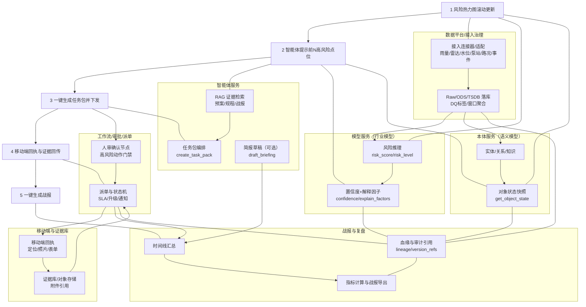
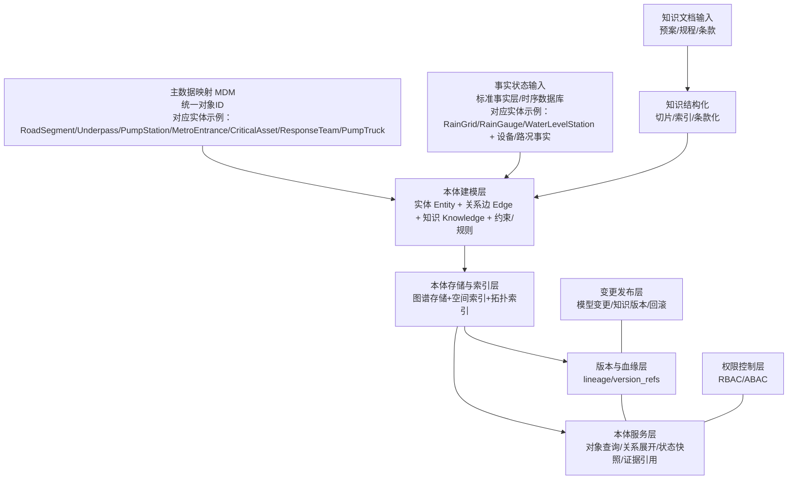
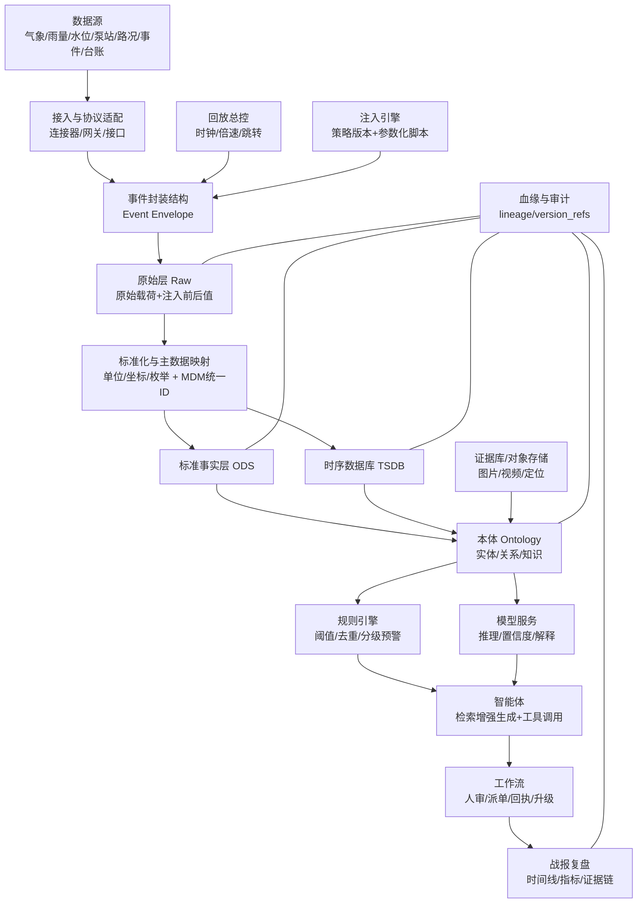
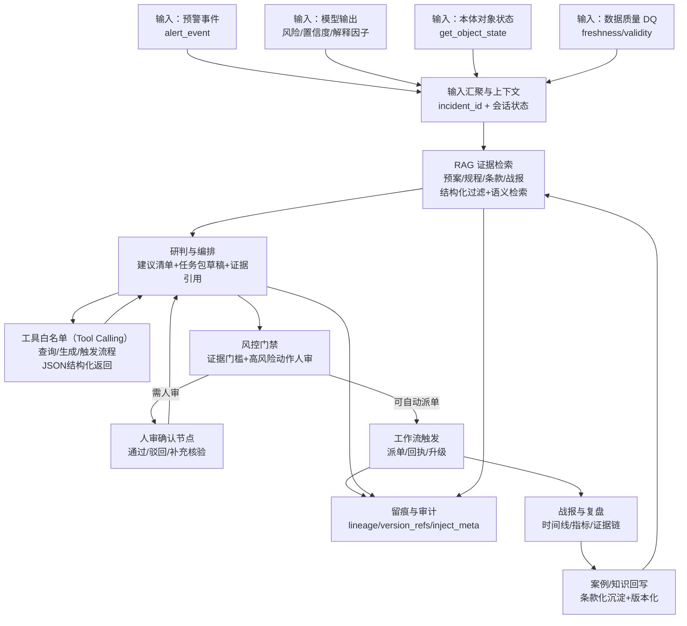
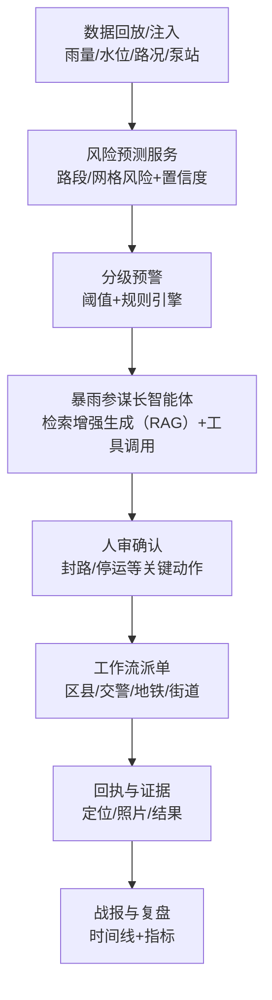

# 应急安全AI操作系统方案书-城市暴雨内涝指挥

数据语义底座 + 智能体（Agent） + 业务工作流闭环

---

## 城市暴雨内涝指挥（深入细化）

### 1.1 故事线

1) 风险热力图滚动更新（未来 1–3 小时）  
2) 暴雨参谋长智能体（Agent）提示前 N（TopN）高风险点位（含原因与置信度）  
3) 一键生成“布防/封控/联动”任务包并下发  
4) 移动端回执与证据回传，指挥端实时显示  
5) 一键生成战报（时间线 + 指标 + 依据）

#### 1.1.1 功能 → 模块 → 责任方（谁来完成）

> 说明：这里的“责任方”按系统组件拆分（可对应到团队/子系统），便于研发与交付拆分任务与接口边界。

- **1) 风险热力图滚动更新（未来 1–3 小时）**
  - **对应模块**：数据接入与标准事实层（`1.9.1`）+ 特征与模型推理服务（`1.9.3`）+ 本体对象状态服务（`1.3`）+ 指挥端可视化（界面/UI）
  - **谁来完成（组件责任）**：
    - **数据平台/接入服务**：采集雨量/雷达/水位/泵站/路况，写入 Raw/ODS/TSDB，打 DQ 标签
    - **模型服务**：生成网格/路段风险（含 `confidence`、`explain_factors[]`），提供热力图/TopN 接口
    - **本体服务**：提供对象空间归属、关系展开、状态快照（给地图叠加与联动）
    - **指挥端前端（界面/UI）**：渲染热力图、时间轴、对象详情与置信度提示

- **2) 智能体提示前 N 高风险点位（含原因与置信度）**
  - **对应模块**：智能体设计与工程化（`1.6`/`1.9.4`）+ 模型服务（`1.9.3`）+ 本体状态接口（`get_object_state`）
  - **谁来完成（组件责任）**：
    - **智能体服务**：拉取 TopN 风险、检索增强生成（RAG）引用预案/规程，输出结构化建议与依据引用
    - **模型服务**：提供 TopN 风险结果与解释因子/置信度
    - **本体服务**：提供风险对象的上下文（邻近重点目标、服务范围、责任片区）

- **3) 一键生成“布防/封控/联动”任务包并下发**
  - **对应模块**：智能体任务包编排（`create_task_pack`，见 `1.6.4/1.9.4`）+ 风控门禁与人审（`1.6.6`）+ 工作流引擎派单（`1.7`/`1.9.5`）
  - **谁来完成（组件责任）**：
    - **智能体服务**：把建议转换为可派单任务包（`tasks[]`，含 owner_org/SLA/required_evidence/need_approval）
    - **人审/审批服务（工作流节点）**：对封控/停运/跨部门联动等高风险动作做审核通过/驳回/补充核验
    - **工作流服务**：任务落库、路由到责任单位/人员、通知下发、状态机追踪与升级

- **4) 移动端回执与证据回传，指挥端实时显示**
  - **对应模块**：移动端回执（`1.9.5`）+ 工作流状态机与证据链（`1.7/1.9.5`）+ 本体/证据库引用（`1.3/1.4.6`）+ 指挥端联动展示（界面/UI）
  - **谁来完成（组件责任）**：
    - **移动端应用**：任务列表、回执表单、定位/照片/视频上传、离线缓存（可选）
    - **工作流服务**：回执入库、证据校验（required_evidence）、状态推进、超时升级
    - **证据库/对象存储**：存放附件并返回引用 ID；与任务/事件绑定形成证据链
    - **指挥端前端（界面/UI）**：实时展示任务进度、证据、时间线与地图联动

- **5) 一键生成战报（时间线 + 指标 + 依据）**
  - **对应模块**：时间线与战报/复盘（`1.9.6`）+ 审计追溯（`1.4.6`）+ 智能体简报生成（`draft_briefing`，可选）
  - **谁来完成（组件责任）**：
    - **战报与复盘服务**：汇总时间线（预警/模型/智能体/人审/派单/回执），计算指标并生成可导出战报
    - **审计/血缘服务**：提供 `lineage + version_refs + inject_meta（如有）` 追溯信息，支撑依据引用
    - **智能体服务（可选）**：生成“研判摘要/指挥纪要草稿”，但必须引用证据

#### 1.1.2 设计图（故事线功能到模块与责任方）



### 1.2 行业知识

#### 1.2.1 必备行业知识/资料（用于检索增强生成（RAG）、规则配置、验收口径）

- **预案与规程**
  - **暴雨内涝应急预案**：明确分级响应、部门职责、处置流程、信息报送与联动机制。
  - **道路封控/交通管制标准**：不同积水深度/流速/能见度下的封控触发条件与处置要求。
  - **地铁限流/停运规则**：出入口关闭、限流阈值、停运条件、与地面交通联动策略。
  - **泵站启停与巡检规程**：启停条件、运行工况、故障处置、维护窗口与安全要求。

- **基础台账与对象清单**
  - **易涝点清单**：历史积水点位、下凹立交/涵洞/低洼路段，包含位置、阈值、责任单位。
  - **排水设施台账**：泵站、闸门、雨水口、箱涵、雨水管网关键节点与能力参数。
  - **监测点位台账**：雨量站、水位站、泵站测点、积水监测点，包含设备状态与校准信息。
  - **重点保障目标清单**：医院、变电站、地铁站、交通枢纽、危旧房等，包含保护等级与联动联系人。

- **气象与水文工程口径**
  - **短临预报/雷达产品说明**：产品时效、空间分辨率、误差特征、适用范围（影响置信度解释）。
  - **强度-历时-频率（IDF）曲线/设计暴雨参数（如有）**：用于阈值与能力对比（雨强-历时-频率口径统一）。

- **联动资源与组织体系**
  - **应急资源清单**：排涝车、移动泵、沙袋、警力、抢修队伍，包含驻点、到场时长与能力。
  - **组织与责任体系**：区县/街道/网格、交警、地铁、排水公司、城管等职责边界与协同机制。

#### 1.2.2 术语与行业概念速查（每条简述，便于对外讲解与对内落表）

- **短临预报**：0–2 小时级别的短时临近降水预报，适合指挥调度但误差随时间拉长而增大。
- **雷达回波**：天气雷达对降水粒子的反射信号，可用于识别强降雨区域与移动趋势。
- **雨强（mm/h）**：单位时间降水强度，常用于触发阈值与评估排水压力。
- **累计雨量**：一段时间内的降水总量（如 1h/3h/24h），与内涝风险强相关。
- **汇水区/汇水分区**：地形与管网共同决定的“雨水汇集单元”，用于把雨量映射到风险对象。
- **汇流/产流**：降雨转化为地表径流并向低洼处汇集的过程，决定积水形成速度与峰值。
- **不透水率**：硬化地表比例，越高越易形成快速径流，内涝风险越高。
- **排水能力**：道路/片区通过管网、泵站、闸门向外排水的能力参数（与雨强对比形成“超载”判断）。
- **雨污合流（合流制）**：雨水与污水同管，暴雨时易超负荷，需关注溢流与倒灌风险。
- **内涝**：城市局部积水/淹水现象，常由强降雨、排水超载、回水顶托、设施故障等诱发。
- **积水深度阈值**：用于分级预警与封控的关键指标（例如“超过某深度需封路/关闭地铁出入口”）。
- **下凹立交/涵洞**：典型易涝点位类型，具有“迅速积水、排水受限”的风险特征。
- **汛限水位**：河道/湖库在汛期允许的控制水位，超限会影响城市外排与倒灌风险。
- **顶托/倒灌**：外河水位高或管网满流导致雨水回流上涌，是内涝快速恶化的常见原因。
- **泵站启停策略**：泵站在不同水位/流量/电力条件下的启停规则，直接影响排涝效率与能耗。
- **工况切换**：设备/系统运行状态变化（如泵启停、阀门开关、维护模式），会影响异常检测与误报控制。
- **黄/橙/红预警**：分级预警体系，映射不同响应强度与行动清单（规则引擎需可配置）。
- **响应级别/分级响应**：预警触发后的组织响应强度（如 IV/III/II/I 级），对应不同部门联动与资源投入。
- **封控/交通管制**：对道路/匝道实施临时关闭、限行或绕行，引导人车避险并保障抢险通道。
- **联合指挥**：多部门在同一事件下统一态势、统一口径、统一调度的协同模式。
- **一张图**：将风险、对象、资源、任务、证据与时间线统一在同一态势视图呈现。
- **任务回执**：任务执行结果回传（到场、处置、证据），是闭环验收与复盘审计的关键数据。
- **SLA（服务时限）**：任务在规定时间内完成的要求，用于超时升级、催办与绩效统计。
- **证据链**：从预警/决策到执行/回执的可追溯证据集合（数据、规则/模型版本、附件材料），支撑审计与复盘。

#### 1.2.3 英文/缩写/字段中文对照（本文统一口径）

- **关键英文术语**
  - **Agent（智能体）**：可受约束地理解态势、生成方案并调用工具/触发流程的智能执行单元。
  - **Ontology（本体/语义模型）**：把行业对象、关系与规则知识结构化，形成“机器可理解的世界模型”。
  - **Workflow（工作流）**：把研判、审批、派单、回执、升级等业务过程固化为可追踪状态机。
  - **RAG（检索增强生成）**：先检索证据（预案/规程/案例/实时态势），再生成建议，降低幻觉风险。
  - **TopN（前 N）**：按风险/影响排序取前 N 个目标点位/对象。
  - **UI（界面）**：指挥端/移动端的交互展示与回执入口。
  - **API（接口）**：服务对外提供的调用入口（HTTP/RPC 等）。
  - **JSON（结构化数据格式）**：用于工具返回与前后端传输的结构化数据表示。
  - **ID（标识/编号）**：对象/任务/事件等的唯一标识符。
- **关键工程缩写**
  - **MDM（主数据管理/主数据映射）**：把多源系统编码映射到平台统一对象 ID。
  - **ODS（标准事实层/操作数据存储）**：单位/字段/坐标统一后的标准事实数据层。
  - **TSDB（时序数据库）**：高频测点数据存储与窗口聚合的专用数据库/层。
  - **Raw（原始层）**：保留源系统原始载荷的数据层，支撑审计与回放。
  - **DQ（数据质量）**：freshness/accuracy/completeness/validity 等质量维度与标签。
  - **SLO（服务等级目标）**：对时延/可用性/成功率等的可量化目标。
  - **P95（95 分位）**：时延等指标的 95 分位统计口径（用于衡量尾部性能）。
  - **Schema（结构/约束）**：结构化输出/接口字段的固定结构定义（便于系统对接与验收）。
  - **ModelOps（模型运维）**：模型训练、评估、发布、监控、回滚的一整套工程化流程。
  - **Model Registry（模型注册中心）**：集中管理模型版本、指标、审批与发布状态的组件。
  - **Feature Store（特征库/特征服务）**：统一管理并服务化输出离线/在线特征，保证口径一致。
  - **DSL（领域特定语言）**：面向业务规则的专用表达语言（便于配置中心可视化）。
  - **CEL（通用表达语言）**：轻量表达式语言，用于规则条件计算。
  - **JSONLogic（JSON 逻辑）**：用 JSON 表达规则条件的方式/库。
  - **Drools（规则引擎）**：常用规则引擎实现之一。
  - **Rulebook（规则手册/规则集框架）**：规则集组织与运行框架的泛称（按选型落地）。
  - **PLC（可编程逻辑控制器）**：现场设备控制单元。
  - **SCADA（监控与数据采集）**：工业监控与采集系统（测点/告警/工况）。
  - **ETA（预计到达时间）**：调度资源预计抵达现场的时间估计值。
- **常见几何类型（空间字段）**
  - **Point（点）**：单点坐标位置。
  - **LineString（线串）**：路段等线状对象几何。
  - **Polygon（多边形）**：区域/网格等面状对象几何。
  - **BoundingBox（包围盒）**：用于快速检索的矩形范围。
- **说明**：本文中 `GET/POST/flowchart/TB` 等属于接口或 Mermaid（流程图语法）关键字，为保证可复制执行，保留英文不做替换；但其含义已在上下文与对照表中说明。

### 1.3 本体（Ontology，最小可用对象模型）

#### 1.3.0 本体设计架构图（仅体现本体，文字 + Mermaid）

- **文字版（仅本体内部：建模→存储→服务→治理）**

主数据映射（MDM：统一对象 ID） + 事实状态输入（标准事实层/时序数据库） + 知识文档输入（预案/规程/条款）  
→ 本体建模（实体 Entity + 关系边 Edge + 知识 Knowledge + 约束/规则）  
→ 本体存储与索引（图谱存储 + 空间索引 + 拓扑索引 + 版本管理）  
→ 本体服务层（对象查询/关系展开/对象状态快照/时间线与证据引用接口）  
→ 本体治理与审计（血缘 lineage + 版本 version_refs + 权限控制 + 变更发布）

- **Mermaid（可复制渲染，仅本体）**



- **实体对应关系（把“架构层”与“具体实体”对齐）**
  - **主数据/台账类（经 MDM 统一 ID 后入本体）**：`RoadSegment/Underpass/PumpStation/MetroEntrance/CriticalAsset/ResponseTeam/PumpTruck`
  - **事实观测/态势类（来自标准事实层/时序数据库，汇入对象状态）**：`RainGrid/RainGauge/WaterLevelStation` + 路况/泵站运行等事实字段
  - **过程协同类（来自派单与回执，形成事件任务网）**：`Incident/Task`
  - **关系边（Edge，贯穿以上实体）**：`locatedIn/near/serves/affects/targets/contains/monitors` 等（用于空间归属、服务范围、影响传播与任务目标绑定）

- 实体：`RainGrid/RainGauge/WaterLevelStation/RoadSegment/Underpass/PumpStation/MetroEntrance/CriticalAsset/ResponseTeam/PumpTruck/Task/Incident`  
  - **`RainGrid`（降雨网格）**：承载雷达/短临的格点降雨与预测结果，用于热力图与网格级风险输入。
    - **关键字段（建议）**：
      - `grid_id`：网格唯一标识（与地图瓦片/网格体系一致）。
      - `geometry`：网格空间范围（多边形 Polygon/包围盒 BoundingBox，用于空间叠加与查询）。
      - `rain_now_mmph`：当前雨强（单位建议统一 `mm/h`）。
      - `rain_forecast[]`：未来多时刻雨强序列（如 t+15/30/60/120min）。
      - `product_ref`：气象产品来源（雷达/短临模型/融合产品）与版本。
      - `confidence`：产品置信度/不确定性指标（用于下游解释与降级）。
  - **`RainGauge`（雨量站）**：点位雨量观测与质量标记，用于校准/修正网格降雨、触发阈值。
    - **关键字段（建议）**：
      - `gauge_id`：雨量站 ID（需与源系统编码做 MDM 映射）。
      - `location`：经纬度/行政区/所属片区（用于空间归属与路段关联）。
      - `rain_5m_mm`：近 5 分钟雨量（单位建议 `mm`）。
      - `rain_1h_mm`：近 1 小时累计雨量（单位建议 `mm`）。
      - `status`：设备状态（在线/离线/维护/故障）。
      - `dq_tags`：质量标签（新鲜度/完整性/有效性等）。
  - **`WaterLevelStation`（水位站/河道水位）**：外河/内河/闸口水位与趋势，用于判断顶托/倒灌风险与外排条件。
    - **关键字段（建议）**：
      - `station_id`：水位站 ID（MDM 映射后统一）。
      - `location`：经纬度 + 所属河段/闸口/行政区。
      - `level_m`：水位（单位 `m`，统一基准面/高程基准说明）。
      - `trend`：趋势（上升/下降/平稳）或斜率（`m/h`）。
      - `flood_limit_level_m`：汛限/警戒水位（用于阈值与解释，缺省可空）。
      - `dq_tags`：质量标签（延迟/缺失/异常值）。
  - **`RoadSegment`（路段）**：核心风险承载对象（通行能力/易涝属性/任务归属），用于封控/绕行与风险 TopN。
    - **关键字段（建议）**：
      - `road_id`：路段 ID（与交管/地图路网做映射）。
      - `geometry`：路段线几何（线串 LineString）。
      - `admin_area`：行政区/责任片区（用于派单路由）。
      - `elevation_m`：路段相对高程/低洼度（单位 `m`，用于易涝特征）。
      - `drainage_capacity`：排水能力参数（可用等级或估算值，口径需统一）。
      - `closure_status`：当前封闭状态（开放/限行/封闭）。
      - `traffic_index`：路况指标（速度/拥堵等级）。
      - `risk_state`：最新风险状态快照（risk_level/score/confidence）。
  - **`Underpass`（下凹立交/涵洞）**：典型易涝点位（阈值敏感），用于“超过阈值→封控/排涝”规则与优先处置。
    - **关键字段（建议）**：
      - `underpass_id`：点位 ID。
      - `location`：点位坐标 + 所属路段/区域。
      - `depth_threshold_m`：积水深度阈值（单位 `m`，用于分级与封控触发）。
      - `linked_road_id`：关联路段 ID（便于联动封控与绕行）。
      - `sensor_ref`：积水/水位传感器关联（如有）。
      - `pump_dependency`：关联泵站/排水口依赖关系（用于能力评估与任务联动）。
  - **`PumpStation`（泵站）**：排涝关键执行设施（能力/工况/故障），用于排涝能力评估、启停建议与联动任务。
    - **关键字段（建议）**：
      - `pump_station_id`：泵站 ID（与 SCADA（监控与数据采集）/资产台账映射）。
      - `location`：泵站坐标 + 服务片区。
      - `status`：工况（运行/停机/维护/故障）。
      - `flow_m3s`：流量（单位 `m³/s`，支持实时与窗口均值）。
      - `power_kw`：功率（单位 `kW`，用于能耗与异常识别）。
      - `fault_code`：故障码/告警码（用于故障注入与解释）。
      - `maintenance_window`：维护窗口（用于误报抑制与数据质量解释）。
      - `design_capacity`：设计能力（用于“能力不足”判断，缺省可空）。
  - **`MetroEntrance`（地铁出入口）**：与积水风险强关联的保护对象，用于限流/关闭建议与派单。
    - **关键字段（建议）**：
      - `entrance_id`：出入口 ID。
      - `station_id`：所属车站 ID（便于车站级联动）。
      - `location`：出入口坐标（与周边易涝点/路段空间关联）。
      - `protection_level`：保护等级（重点/一般/临时封闭优先级）。
      - `closure_rule_ref`：关闭/限流规则引用（关联预案条款/策略版本）。
      - `status`：开放/限流/关闭（与工作流动作一致）。
  - **`CriticalAsset`（重点保障目标）**：医院/变电站/枢纽等，用于影响分析 TopN 与资源优先级分配。
    - **关键字段（建议）**：
      - `asset_id`：目标 ID。
      - `asset_type`：类型（医院/变电站/枢纽/学校等）。
      - `location`：坐标 + 所属区域。
      - `priority`：保障优先级（1–5 或 A/B/C，口径统一）。
      - `owner_org`：责任单位/联系人（用于联动与任务归属）。
      - `impact_threshold`：影响触发阈值（如“附近积水达到 X”），缺省可空。
  - **`ResponseTeam`（应急队伍/处置班组）**：可调度的人员与能力，用于派单路由、到场时长估计与资源匹配。
    - **关键字段（建议）**：
      - `team_id`：队伍 ID。
      - `org`：所属组织（区县/街道/部门）。
      - `capability_tags`：能力标签（排涝/封控/抢修/救援等）。
      - `base_location`：驻点位置（用于 ETA（预计到达时间）估算）。
      - `availability`：可用性（可用/出勤/占用/休整）。
      - `contact`：联系方式（用于通知联动）。
  - **`PumpTruck`（移动泵车/排涝车）**：机动排涝资源，用于布防预置、现场处置与调度联动。
    - **关键字段（建议）**：
      - `truck_id`：车辆 ID。
      - `location`：当前位置（实时定位可选）。
      - `capacity_m3h`：排水能力（单位 `m³/h`，口径统一）。
      - `status`：状态（可用/在途/作业/故障）。
      - `availability`：可用性与预计空闲时间（用于调度）。
      - `assigned_incident_id`：当前绑定事件（便于态势呈现）。
  - **`Task`（任务单）**：闭环执行载体（可追踪、可验收、带证据），用于派单、回执、审计与复盘。
    - **关键字段（建议）**：
      - `task_id`：任务 ID（全局唯一）。
      - `incident_id`：所属事件 ID（形成事件任务网）。
      - `target_object_id`：目标对象（路段/泵站/出入口等）。
      - `task_type`：任务类型（封控/排涝/巡检/劝离/引导等）。
      - `owner_org/assignee`：责任部门/执行人。
      - `SLA`：时限（分钟/小时）+ 超时升级策略引用。
      - `status`：状态机（pending/accepted/in_progress/done/rejected）。
      - `required_evidence`：必需证据（照片/定位/表单字段）规则。
      - `decision_trace`：来源链路（alert_id/agent_run_id/approval_id）。
  - **`Incident`（事件/内涝处置事件）**：把预警、对象、任务、证据组织成一个“事件空间”，用于联合指挥、时间线与战报生成。
    - **关键字段（建议）**：
      - `incident_id`：事件 ID。
      - `area_id`：影响区域（行政区/网格集合/多边形）。
      - `start_time/end_time`：起止时间（end 可空）。
      - `severity`：事件等级（与黄/橙/红/响应级别映射）。
      - `status`：状态（open/handling/closed）。
      - `trigger_alert_ids`：触发预警集合（用于追溯）。
      - `timeline_ref`：时间线引用（战报生成入口）。
      - `owner_org`：牵头单位（联合指挥口径）。
- 关系：空间归属/邻近、服务范围、影响传播、任务目标、事件任务网等  
- 字段示例（片段）：  
  - `RoadSegment`: road_id, geometry, admin_area, elevation_m, drainage_capacity, closure_status  
  - `Underpass`: underpass_id, depth_threshold_m, linked_road_id  
  - `Task`: task_id, incident_id, target_object_id, owner_org, SLA, status, required_evidence
  - **字段说明（对应上面示例字段）**
    - **`road_id`**：路段唯一标识（需与路网/交管编码映射到统一 ID）。
    - **`geometry`**：空间几何（路段为线串 LineString、点位为点 Point、区域为多边形 Polygon；用于空间叠加/范围查询）。
    - **`admin_area`**：行政区/责任片区（用于派单路由、统计与权限控制）。
    - **`elevation_m`**：相对高程/低洼度指标（单位 `m`，口径需与 DEM/测绘基准一致）。
    - **`drainage_capacity`**：排水能力参数（可用数值或等级表达，需统一口径与来源）。
    - **`closure_status`**：封控状态（开放/限行/封闭；与封控工作流动作一致）。
    - **`underpass_id`**：下凹立交/涵洞点位 ID（与台账/传感器映射到统一 ID）。
    - **`depth_threshold_m`**：积水深度阈值（单位 `m`，用于分级预警与封控触发条件）。
    - **`linked_road_id`**：关联路段 ID（用于联动封控/绕行与风险归属）。
    - **`task_id`**：任务单 ID（全局唯一，支持审计与追溯）。
    - **`incident_id`**：所属事件 ID（形成事件任务网与战报时间线）。
    - **`target_object_id`**：任务目标对象 ID（路段/泵站/地铁出入口等）。
    - **`owner_org`**：责任单位（牵头部门/归口单位）。
    - **`SLA`**：任务时限要求（建议拆成 `sla_minutes` + `escalation_policy_ref` 以便计算与升级）。
    - **`status`**：任务状态机状态（pending/accepted/in_progress/done/rejected）。
    - **`required_evidence`**：完结必需证据规则（照片/定位/表单字段等，未满足不可关闭任务）。

### 1.4 数据设计（回放+注入）

**目标**：为构建一套“可重复、可控、可解释”的数据沙盘：同一脚本可 1×/4×/8× 重放；可在关键节点注入故障/拥堵/突增降雨，稳定制造“决策拐点”；并能追溯到每条数据的来源/版本/注入策略。

#### 1.4.0 数据设计架构图（文字 + Mermaid）

- **文字版（从数据到闭环消费的一条链）**

数据源（气象/雨量/水位/泵站/路况/事件/台账）  
→ 接入与封装（连接器/协议适配 → 事件封装结构 Event Envelope）  
→ 原始层（Raw，含注入前后值）  
→ 标准化与主数据映射（单位/坐标/枚举统一 + MDM 统一 ID）  
→ 标准事实层（ODS）与时序数据库（TSDB）  
→ 本体（Ontology：实体/关系/知识）+ 证据库（附件/图片/定位引用）  
→ 回放总控与注入（回放时钟/倍速/跳转 + 策略版本 + 参数化脚本）  
→ 下游消费（规则引擎预警 → 模型推理 → 智能体方案 → 工作流派单/回执 → 战报复盘）  
→ 血缘与审计（lineage/version_refs 全链路追溯）

- **Mermaid（可复制渲染）**



#### 1.4.1 数据范围与数据集清单（最小闭环）

- **气象降雨【事实数据-时空网格/事实数据-时序观测｜建议落层：Raw/标准事实层（ODS）/本体】**
  - **雷达/格点降雨（RainGrid）【事实数据-时空网格】**：网格雨强 `mm/h` + 未来 1–3 小时短临（可选）；用于风险热力图与模型输入。（落层：Raw→标准事实层（ODS）→本体）
  - **雨量站（RainGauge）【事实数据-时序观测】**：点位分钟雨量/累计雨量 + 质量标记；用于校验网格降雨与阈值触发。（落层：Raw→时序数据库（TSDB）/标准事实层（ODS）→本体）
- **水文水位（WaterLevelStation）【事实数据-时序观测｜建议落层：Raw/时序数据库（TSDB）/标准事实层（ODS）/本体】**
  - 河道/闸口水位（分钟级）+ 趋势；用于判断“外排条件/顶托倒灌风险”。（落层：Raw→时序数据库（TSDB）/标准事实层（ODS）→本体）
- **排水设施（PumpStation）【事实数据-设备遥测 + 主数据/资产台账｜建议落层：Raw/时序数据库（TSDB）/标准事实层（ODS）/本体】**
  - 泵站启停、流量、功率、故障码、维护窗口（秒级/分钟级）；用于排涝能力与故障注入。（落层：Raw→时序数据库（TSDB）/标准事实层（ODS）→本体）
- **交通路况（RoadSegment）【事实数据-交通态势｜建议落层：Raw/标准事实层（ODS）/本体】**
  - 路段速度/拥堵等级/封闭状态（分钟级）；用于“可达性/封控建议/绕行”。（落层：Raw→标准事实层（ODS）→本体）
- **事件与处置事实（Incident/Task）【过程数据/事实数据-事件流｜建议落层：Raw/标准事实层（ODS）/本体】**
  - 报警/投诉/网格事件（事件流）；任务派单、回执、证据附件（图片/视频/定位）用于闭环与战报。（落层：Raw→标准事实层（ODS）→本体；附件进入证据库/对象存储并在本体留引用）
- **静态台账（一次性加载）【主数据/基础台账｜建议落层：主数据映射（MDM）/本体】**
  - 道路/下凹立交/地铁出入口/重点目标的几何、阈值、责任单位、排水能力等。（落层：台账→主数据映射（MDM）统一 ID→本体）

#### 1.4.2 回放总控：时钟、速度、对齐与一致性

**含义**：回放总控是一套“演练数据播放控制系统”，用统一时间轴把历史/模拟数据稳定播放出来，并保证多源数据在回放时不乱序、不漂移、可复现。  
**作用**：让整套演练过程做到**可控（能控节奏）**、**可信（数据顺序正确）**、**可复现（同脚本同结果）**，从而支撑预警→研判→派单→回执→战报的闭环演练与验收。

- **时钟（回放时间控制器）**：把“回放时间”从真实时间中解耦，支持暂停/继续/跳转到关键拐点，便于讲解与触发处置。
- **速度（倍速控制）**：支持 1×/4×/8× 等倍速，把数小时过程压缩到分钟级，同时保持各数据源相对时序一致。
- **对齐（事件发生时间对齐）**：以 `event_time` 作为统一基准，解决多源数据乱序/延迟到达问题，避免“逻辑穿帮”。
- **一致性（窗口/聚合/特征一致）**：回放跳转/倍速时，触发窗口聚合与特征计算的重算/回补，保证模型输入、预警判定与界面呈现一致。

- **回放时钟（Replay Clock，回放时间控制器）**
  - 以 `replay_session_id` 管理一次演示；回放时间轴 `t_replay` 与真实时间 `t_now` 解耦。
  - 支持倍速：`speed=1|4|8`；支持 `pause/resume/seek`（跳转到关键拐点）。
- **多源对齐（事件时间 Event Time 对齐）**
  - 所有流数据统一使用 `event_time` 驱动；回放输出的 `ingest_time` 由系统生成，便于演示“端到端时延”。
- **窗口计算一致性**
  - 时序数据库（TSDB）窗口聚合（5/15/60 分钟）以 `event_time` 为准；回放跳转时触发“窗口重算/回补”。

#### 1.4.3 统一事件契约（回放/注入都必须遵守）

**含义**：统一事件契约就是把所有来源的数据（雨量、水位、泵站、路况、报警、任务回执等）先包装成同一种“事件结构”（统一字段、统一时间口径、统一对象引用、统一质量与血缘信息）。  
**作用**：让多源数据能被同一套规则/模型/智能体/工作流稳定消费，做到**可对接（字段一致）**、**可追溯（血缘与版本）**、**可复盘（回放可还原）**、**可验收（指标可量化）**。

- **为什么必须统一**
  - **消除异构**：不同系统字段名/单位/坐标/枚举不同，统一契约后下游只处理一种结构，减少对接成本与错误率。
  - **统一时间口径**：以 `event_time` 为主，`ingest_time` 辅助衡量时延，避免乱序/迟到造成的逻辑穿帮。
  - **统一对象引用**：用 `object_ref` 把事件绑定到业务对象（路段/泵站/网格等），支撑空间关联、派单路由与一张图态势。
  - **统一质量与追溯**：用 `dq_tags + lineage + inject_meta` 说明“数据好不好、从哪里来、是否注入、用的哪个版本”，支撑解释与审计。

- **事件封装结构（Event Envelope：事件统一封装/事件载体，建议字段）**
  - `event_id`：事件唯一标识（全局唯一）
  - `replay_session_id`：回放会话标识（非回放为空）
  - `event_time / ingest_time`：事件发生时间 / 接入时间
  - `source_system / event_type`：来源系统 / 事件类型
  - `object_ref`（对象引用）：`{object_type, object_id}`（对象类型/对象标识；或源系统对象编码）
  - `payload`（载荷/内容）：业务值（含单位/坐标/枚举等）
  - `dq_tags`（数据质量标签）：`freshness/accuracy/completeness/validity`（新鲜度/准确性/完整性/有效性）
  - `lineage`（血缘/溯源信息）：`raw_hash, schema_version, transform_version`（原始哈希/结构版本/转换版本）
  - `inject_meta`（可选，注入元信息/注入信息）：`{is_injected, inject_type, inject_policy_version, inject_params}`（是否注入/注入类型/注入策略版本/注入参数）

#### 1.4.4 注入设计：注入类型、策略版本与参数化脚本

**含义**：注入设计是在回放/演练数据流中，按预设规则**人为制造可控的“拐点事件”**（如雨强突增、泵站故障、道路封闭），并用**策略版本（`inject_policy_version`）**与**参数化脚本（`inject_params`）**明确“何时、对哪里/哪个对象、以多大强度、持续多久”实施注入。  
**作用**：让演练过程做到**可控可复现**、稳定出现**关键决策点**，并通过 `inject_meta` 形成可解释可追溯的证据链，用于验证规则/模型/智能体/工作流在异常场景下的表现与降级策略。

- **可控可复现**：同一 `inject_policy_version + inject_params` 多次回放，能稳定复现相同拐点与链路响应，便于验收与压测。
- **制造关键决策点**：确保一定触发“预警升级/研判/派单/封控/联动”等关键动作，避免过程过于平淡或随机翻车。
- **可解释可追溯**：注入数据带 `inject_meta`，战报/复盘能解释“变化来自真实数据还是注入”，支撑审计与复现。
- **工程化验证全链路**：用注入覆盖故障/缺失/拥堵等边界条件，验证告警去重抑制、模型降级、审批控制、任务回执与指标计算。

- **注入类型（必备三类）**
  - **雨强突增**：指定区域/网格在 `T0~T1` 提升雨强（阶跃/斜坡）；用于触发预警升级。
  - **泵站故障/降容**：指定泵站在 `T0` 进入故障（停机/降载/流量衰减）；用于制造“排涝能力不足”的拐点。
  - **道路拥堵/封闭**：指定路段拥堵等级上升或封闭；用于改变任务可达性与封控决策。
- **注入脚本（策略 Policy）**
  - 每次注入必须有 `inject_policy_version`，并记录 `inject_params`（区域、强度、持续时间、目标对象）。
  - 支持“手动一键触发”和“按时间轴自动触发”两种模式。
- **注入后的可解释要求**
  - 界面（UI）/智能体（Agent）必须能引用：注入类型、目标对象、注入生效时间、影响范围（作为证据链的一部分）。

#### 1.4.5 数据质量与可信度提示（体现工程可靠性）

**含义**：数据质量与可信度提示，是把“数据是否可靠/是否及时/是否完整”工程化成可计算的质量标签（DQ）与置信度（`confidence`）机制，并在界面与智能体输出中明确展示“为什么可信/为什么不可信”。  
**作用**：避免用“脏数据”驱动错误决策，降低误报/漏报与演练翻车概率，同时让每次预警与建议都**可解释、可追溯、可审计**（能说清楚数据质量对结果的影响）。

- **保障研判可信**：当关键测点缺失/延迟/异常时，自动降低 `confidence` 并输出原因，提醒“需要补充核验数据”。
- **保障规则/模型稳定**：通过维护窗口屏蔽、异常值隔离与一致性校验，减少规则误触发与模型输入漂移。
- **保障闭环可验收**：把质量指标（缺失率、延迟、异常率）与影响（置信度变化、降级策略）固化为可量化验收项。

- **DQ（数据质量）标签生成规则**
  - 缺失/延迟/超范围/传感器维护窗口 → 置 `validity=false` 或降低 `freshness`。
  - 关键测点（泵站/水位/雨量）缺失时：模型与智能体（Agent）输出必须降低 `confidence` 并说明原因。
- **一致性校验（减少“演示翻车”）**
  - 雨量站与网格降雨偏差超过阈值 → 标记“需人工核验”并提示“数据源不一致”。
  - 泵站状态=停机但流量>0 → 识别为异常数据并隔离（或走修正通道）。

#### 1.4.6 存储落地与可追溯（支撑审计/复盘/回测）

**含义**：存储落地与可追溯，是把数据按“原始层→标准事实层→时序层/语义层”等分层落库，并为每条数据、每次预警/任务结果记录完整的血缘与版本引用（数据来自哪里、经过哪些转换、用的哪版规则/模型/注入策略）。  
**作用**：让系统具备**可审计**（能查到源头证据）、**可复盘**（能还原当时态势与决策依据）、**可回测**（可用历史数据重跑规则/模型验证指标）、**可追责**（关键动作有证据链）等工程能力；也是对外验收与对内持续迭代的基础。

- **原始层（Raw）**：保留原始载荷与注入前后值（注入也要留 Raw），便于审计与复盘。
- **标准事实层（ODS）/时序数据库（TSDB）层**：写入标准化事实与窗口聚合；每条记录带 `schema_version/transform_version`。
- **演示证据链**
  - 任一预警（`alert_event`）必须能追溯到：输入数据（原始层 Raw/标准事实层 ODS）、规则版本、模型版本、注入策略版本（如有）。

#### 1.4.7 验收指标（“可重复、可解释、可闭环”）

**含义**：验收指标是把“这套系统是否真的可交付、可用、可管控”的要求，固化成可量化的检测项。这里强调的“三个可”分别对应：

- **可重复**：同一套回放与注入脚本多次运行，关键结论与关键节点稳定一致（可复现实验）。
- **可解释**：预警/建议/任务能说明依据（数据质量、血缘、规则/模型版本、注入元信息），不靠“拍脑袋”。
- **可闭环**：从发现风险到派单处置再到回执与复盘有完整链路，且关键过程可追踪、可统计。

**作用**：把演练与交付从“主观好不好看”变成“客观能不能验收”。它用于：

- **对外验收**：客户可按指标逐项核验（时延、命中、追溯、稳定性）。
- **对内迭代**：用同一指标做回归验证，避免改动后能力退化。
- **对上线兜底**：为 SLO/告警阈值、降级策略提供可落地的目标与基线。

- **可重复**：同一 `replay_session_id + inject_policy_version` 多次运行，关键节点（预警升级/任务派单）时间点误差 ≤ 1 分钟。
- **时延可控**：回放模式下端到端（回放输出→ODS）P95 ≤ 5s（演示环境）。
- **注入命中**：注入事件在界面（UI）/智能体（Agent）可见，且能触发预期规则/模型变化（命中率 ≥ 95%）。
- **追溯完整**：抽样 10 条预警/任务，均能查到 `lineage + inject_meta（注入元信息） + version_refs`。

### 1.5 模型与服务

- 时空预测：网格/路段风险 + 置信度  
- 影响分析：关键设施 TopN + 优先级  
- 可解释：贡献因子（雨强/地形/排水/历史黑点）

#### 1.5.1 是否需要“大模型能力 + 小模型能力”？结论与分工

- **结论**：本节的“模型与服务”建议采用 **小模型（行业模型）为主、大模型（智能体）为辅** 的组合。
  - **小模型（行业模型）**：负责“算得准、算得快”的部分——风险预测、异常检测、影响分析/评分、置信度与解释因子输出。
  - **大模型（智能体能力）**：负责“说得清、派得出”的部分——检索增强生成（RAG）、研判摘要、处置方案编排、结构化任务包生成、工具调用与审批约束。

#### 1.5.2 需要部署吗？推荐部署形态（可按合规选择）

- **小模型（行业模型）通常需要部署推理服务**
  - 原因：需要持续、低时延、可控成本的实时/准实时推理（风险热力图、TopN 风险点位、影响范围等）。
  - 形态：容器化部署（私有云/专有云/本地机房均可），对外暴露“推理服务接口（API）”。

- **大模型（智能体能力）不一定必须自建部署**
  - **外部大模型接口（API）调用**：上线最快；但受网络/成本/合规限制。
  - **私有化部署大模型**：满足离线/涉密/合规；需要 GPU 资源与推理服务运维能力。
  - **混合形态（推荐）**：智能体对外接口稳定不变，底层“大模型提供方”可插拔替换（外部接口 ↔ 私有化），降低锁定风险。

#### 1.5.3 小模型（行业模型）完整技术实现方式

- **输入数据（来自 1.4/1.9.1 的数据链路）**
  - 实时/准实时：雨量、水位、泵站工况、路况、事件流（均按事件封装结构统一，含数据质量标签 DQ）。
  - 静态：道路低洼度、排水能力、历史黑点、重点目标邻近度、泵站设计能力等。

- **特征工程（建议工程化落地为“特征库/特征服务（Feature Store）”）**
  - 在线窗口：5/15/60 分钟雨强、累计雨量、上游水位梯度、泵站状态与故障、路况指数等。
  - 静态特征：地形低洼度、排水能力、历史黑点频次、关键资产邻近度。
  - 一致性：训练（离线）与推理（在线）共用同一口径与版本（`feature_set_version`）。

- **模型类型（可插拔）**
  - **时空风险预测**：网格/路段风险值（`risk_score/risk_level`）+ `confidence`。
  - **异常检测**：泵站/水位/雨量/路况的异常与漂移（用于误报控制与解释）。
  - **影响分析/排序**：将风险映射到关键设施 TopN 与优先级（可用规则+模型融合）。

- **训练/回测/发布（ModelOps，模型运维）**
  - 数据集：从回放/演练数据与历史事件对齐“标签”（积水、封路、投诉、报警、处置结果）。
  - 回测：命中率、提前量、误报/漏报、空间偏差；产出可导出的评估报告（用于验收与对外说明）。
  - 发布：模型注册中心（Model Registry）记录 `model_version`、训练数据窗口、指标、审批；支持灰度/回滚。

- **在线推理服务（必须工程化）**
  - 统一输出：`risk_score, risk_level, confidence, explain_factors[], model_version, feature_set_version`。
  - 缓存与批处理：区域 TopN、分区批量推理；支持超时与降级策略。
  - 降级兜底：数据缺失或质量差时，自动回退到“规则/历史黑点优先级”，并显式降低 `confidence`、输出原因。

#### 1.5.4 大模型（智能体能力）完整技术实现方式（对接 1.6/1.9.4）

- **核心原则**：大模型不直接“拍板执行”，而是在证据与约束下生成结构化建议，并通过工具调用进入审批与工作流闭环。
  - **检索增强生成（RAG）**：先检索预案/规程/条款/历史战报 + 本体对象状态，再生成建议。
  - **工具调用（白名单）**：查询 TopN 风险、查询影响目标、生成任务包、触发流程、生成简报；工具返回结构化 JSON。
  - **强制输出结构（Schema）**：解释（why）+ 方案（what）+ 任务包（do）+ 依据引用（evidence）+ 风控约束（risk_controls）。

- **部署与安全（按合规选型）**
  - 推理位置：外部接口/私有化部署/混合可插拔。
  - 安全控制：提示词注入防护、工具调用鉴权、敏感信息脱敏、审计留痕（请求/响应/引用证据/版本号）。
  - 高风险动作：封路/停运/大范围联动必须走人审确认节点（工作流强约束）。

#### 1.5.5 端到端接口契约（模型服务与智能体对接的“硬边界”）

- **模型推理接口（示例）**：见 `1.9.3 模型服务（推理端规范）`，重点是输出必须带 `confidence + explain_factors + model_version`。
- **智能体对外接口（示例）**：见 `1.9.4 智能体（Agent）工程化`，重点是输出必须带证据引用与可派单任务包。

#### 1.5.6 监控、告警与运维（上线必备）

- **性能**：推理时延 P95、成功率、吞吐；大模型调用时延与失败率。
- **质量**：数据质量（DQ）分布、`confidence` 分布、误报/漏报趋势、TopN 命中率。
- **漂移**：特征分布漂移、输出分布漂移；触发回测与降级策略。
- **审计**：关键建议可追溯到 `lineage + version_refs + inject_meta（如有）`。

### 1.6 智能体（Agent）设计（暴雨参谋长）

#### 1.6.0 设计图（文字 + Mermaid）

- **文字版（输入→证据→编排→门禁→闭环）**

输入（预警事件 `alert_event` + 模型输出 + 本体对象状态 + 数据质量标签 DQ）  
→ 证据检索（检索增强生成（RAG）：预案/规程/条款/历史战报 + 结构化过滤）  
→ 研判与编排（生成结构化建议 + 任务包草稿 + 证据引用）  
→ 工具白名单（查询/生成/触发流程；结构化 JSON 返回；幂等与审计）  
→ 风控门禁（高风险动作必须人审确认；证据不足输出核验清单）  
→ 闭环输出（任务包进入工作流派单/回执；时间线与战报复盘；全链路血缘与版本追溯）

- **Mermaid（可复制渲染）**



#### 1.6.1 定位与边界（“能做什么/不能做什么”）

- **定位**：暴雨参谋长智能体（Agent）是“证据驱动的研判与编排器”，负责把实时态势（本体对象状态+模型输出）与行业知识（预案/规程/条款/历史战报）融合成**结构化处置方案与任务包**。
- **输入**：预警事件（`alert_event`）、模型推理结果（风险/置信度/解释因子）、本体对象状态（路段/泵站/地铁出入口/重点目标）、组织资源能力与在位情况、回放/注入元信息（如有）。
- **输出**：研判摘要、处置建议清单、可派单任务包（含 SLA 与证据要求）、依据引用（条款/数据证据/模型版本）、风险控制（需人审项/禁用动作/前置条件）。
- **硬边界（必须遵守）**
  - **不直接执行高风险动作**：封路/停运/大范围联动/跨部门强制指令 → 必须进入工作流“人审确认”节点后才能触发。
  - **无证据不下结论**：证据不足时必须输出“需要补充的数据清单/核验项”，不得编造。
  - **只调用白名单工具**：所有动作通过工具调用（Tool Calling）完成，工具返回必须结构化，便于审计。

#### 1.6.2 证据来源与知识库（检索增强生成（RAG））

- **知识库范围（必须准备并版本化）**
  - **预案条款库**：暴雨内涝应急预案、响应级别、信息报送与联动机制（按条款号切分，保留引用）。
  - **封控/交通管制标准**：积水深度阈值、能见度/流速等触发条件与动作清单。
  - **地铁限流/停运规程**：出入口关闭、限流阈值、车站级联动规则（含例外与审批口径）。
  - **泵站规程与故障处置**：启停条件、维护窗口、故障码含义、现场处置步骤。
  - **历史战报/复盘案例**：相似事件的处置时间线、有效动作、踩坑点（用于推荐与约束）。
- **索引策略（向量索引 + 结构化索引）**
  - 结构化维度：`城市/行政区/对象类型/条款号/响应级别/关键动作类型`。
  - 向量检索：用于相似案例与语义匹配。
- **版本与引用**：每次检索结果必须带 `knowledge_version` 与 `evidence_refs[]`（文档名/条款号/段落定位）。

#### 1.6.3 检索策略与“证据门槛”（避免幻觉）

- **检索顺序（推荐）**
  - 先“结构化过滤”（对象类型/区域/响应级别/关键动作）→ 再“语义检索”→ 再“去重与重排”（优先条款/规程，其次案例）。
- **证据门槛**
  - 如果建议涉及**封控/停运/疏散/跨部门联动**，必须至少引用：1 条规程/条款 + 1 条数据证据（对象状态/模型解释因子/阈值命中）。
  - 若证据不足：输出 `missing_inputs[]`（缺失数据/需要核验项/建议现场确认点）。

#### 1.6.4 工具白名单（Tool Calling）与参数契约

- **查询类工具（读）**
  - `query_risk_topn(area, n)`：返回 TopN 风险对象（含风险值/置信度/解释因子/模型版本）。
  - `query_assets_at_risk(area)`：返回受影响重点目标 TopN（含优先级与影响原因）。
  - `get_object_state(object_id)`：返回对象状态快照（静态属性+实时事实+关系展开+DQ/版本）。
  - `get_incident_timeline(incident_id)`：返回事件时间线（用于战报/复盘/当前进展）。
- **编排类工具（写，但不落地执行）**
  - `create_task_pack(plan)`：把建议转换为可派单任务包（任务类型、对象、责任单位、SLA、证据要求）。
  - `draft_briefing()`：生成研判摘要/简报（用于人审与指挥留痕）。
- **流程类工具（触发工作流）**
  - `trigger_workflow(flow_id, task_pack)`：触发流程；若包含高风险动作，必须返回“已进入人审确认”状态，不得直达执行。
- **幂等与审计**
  - 工具调用必须携带 `request_id`；写操作必须可幂等；每次调用落审计表（含入参、出参摘要、调用人/角色、时间、版本号）。

#### 1.6.5 强制输出结构（Schema，结构/约束）与示例字段

- **输出必须同时包含“解释 + 结构化结果 + 依据引用”**
  - `summary`：一句话结论（含当前等级与关键风险点）。
  - `situation`：态势要点（引用对象状态与模型输出，包含 DQ 与置信度解释）。
  - `recommendations[]`：建议动作清单（动作、对象、优先级、理由、前置条件）。
  - `tasks[]`：可派单任务（owner_org/assignee/SLA/required_evidence/是否需人审）。
  - `evidence[]`：证据引用（条款/数据证据/模型版本/知识版本/注入元信息）。
  - `risk_controls`：风控约束（需人审项、禁用动作、核验清单）。

```json
{
  "summary": "XX 区域内涝风险上升，建议对路段A/下凹立交B优先处置，并对地铁出入口C进入预关闭准备",
  "situation": {
    "top_risks": [{"target_id":"road-001","risk_level":"红","confidence":0.78}],
    "dq_summary": "雨量站G-12延迟 6 分钟，已降低置信度"
  },
  "recommendations": [
    {"action":"封控准备","target_id":"road-001","priority":1,"reason":"雨强突增+低洼+历史黑点","preconditions":["人审确认"] }
  ],
  "tasks": [
    {"task_type":"现场巡查","target_object_id":"underpass-002","owner_org":"区排水","SLA":"30m","required_evidence":["定位","照片"],"need_approval":false}
  ],
  "evidence": [
    {"type":"rule_clause","ref":"道路封控标准-条款3.2","quote":"…"},
    {"type":"data","ref":"get_object_state(road-001)","version_refs":"schema_v2"},
    {"type":"model","ref":"flood_risk_model_v12","explain_factors":["雨强","低洼","排水能力"]}
  ],
  "risk_controls": {"need_approval_actions":["封控","停运"],"missing_inputs":["路段A现场积水深度核验"]}
}
```

#### 1.6.6 与人审/工作流的衔接（“可控”落地）

- **触发点**：`alert_event` 或模型风险升级触发“研判确认”。
- **人审材料**：智能体必须输出可直接用于审批的“摘要 + 证据引用 + 任务包草稿”。
- **审批结果回写**：审批通过/驳回/要求补充材料 → 回写事件时间线，并影响下一轮智能体建议（例如补充核验项）。

#### 1.6.7 记忆、状态与多轮对话（避免前后矛盾）

- **短期记忆**：同一 `incident_id` 的关键事实（TopN 风险、已派任务、未完成核验项）写入会话状态，确保多轮一致。
- **长期记忆**：复盘后的有效动作与失败原因进入案例库（供检索增强生成（RAG）检索），并版本化。
- **状态机（建议）**：`watch(监测)` → `assess(研判)` → `propose(出方案)` → `approve(人审)` → `dispatch(派单)` → `verify(核验)` → `close(关闭)`。

#### 1.6.8 安全、权限与审计（上线必备）

- **权限**：智能体工具调用继承调用人权限（RBAC/ABAC）；跨区/跨部门查询必须被拦截或脱敏。
- **审计**：记录每次对话输入、检索证据、工具调用、输出结构、引用版本与审批链路（可追溯到 `lineage + version_refs + inject_meta`）。
- **防护**：提示词注入防护、敏感信息脱敏、输出合规检查（禁止越权建议/禁止无依据断言）。

#### 1.6.9 评测与验收指标（智能体也要工程指标）

- **结构化合规率**：输出 Schema 命中率 ≥ 99%。
- **证据覆盖率**：关键建议/任务必须有证据引用（覆盖率 ≥ 95%）。
- **一致性**：同一事件多轮对话关键结论前后一致（冲突率可量化）。
- **可控性**：高风险动作触发率 100% 进入人审；不得绕过审批直接触发流程执行。

### 1.7 工作流（暴雨处置闭环）

- 节点：预警→研判确认（人审）→方案→派单→回执/证据→评估→战报  
- 状态机：超时升级；关键动作二次确认

### 1.8 流程图（文字 + Mermaid（流程图语法））

- 文字：数据回放/注入 → 风险预测 → 分级预警 → 智能体（Agent）出方案 → 人审 → 派单 → 回执证据 → 战报



### 1.9 技术实现方案（按模块可拆任务）

#### 1.9.1 数据接入与流转（暴雨）

**目标**：把“雨量/水位/泵站/路况/报警”等多源数据，稳定变成可计算、可追溯、可回放的“语义对象状态”，支撑预警/模型/智能体（Agent）/工作流全链路。

- **数据源与频率（建议）**
  - **气象/预报**：雷达格点/短临预报（5–10 分钟）
  - **雨量/水位站**：分钟级（1–5 分钟）
  - **泵站 PLC（可编程逻辑控制器）/SCADA（监控与数据采集）**：秒级到分钟级（30 秒–5 分钟）
  - **路况**：1–5 分钟（拥堵/封路/事故）
  - **投诉/报警/热线/网格事件**：事件流（实时）

- **统一事件封装（事件封装结构 Event Envelope，所有流数据先统一长相）**
  - `source_system` / `event_type` / `event_time` / `ingest_time`
  - `object_ref`（如 `rain_gauge_id/water_station_id/pump_station_id/road_segment_id`）
  - `payload`（值、单位、坐标、质量标记、原始字段）
  - `trace`（`event_id`、`raw_hash`、`ingest_batch_id`、`schema_version`）

- **链路分层（建议落地口径）**
  - **Raw（原始层）**：原始载荷原样落库，支持审计与回放
  - **ODS（标准事实层）**：单位/字段/坐标/枚举统一后的事实表
  - **TSDB（时序数据库 TSDB，高频时序层）**：泵站/水位/雨量等高频趋势与窗口聚合
  - **本体（Ontology，语义层）**：对象（实体 Entity）+关系（关系边 Edge）+规则/知识（知识 Knowledge），为智能体与业务查询提供“世界模型”

- **标准化与转换规则（必须固化为可配置流水线）**
  - **单位/量纲统一**：雨量 `mm/h`、水位 `m`、泵站流量 `m³/s`、功率 `kW`（统一到平台标准）
  - **空间统一**：统一坐标系；道路/网格/行政区建立空间索引（行政区→网格→路段/点位）
- **数据质量标签（DQ，数据质量）**：每条记录写入 `freshness/accuracy/completeness/validity`，模型与智能体（Agent）可引用（例如“数据延迟导致置信度下降”）

- **主数据映射（MDM，主数据管理/映射，跨系统同一对象归一）**
  - 表：`mdm_object_mapping(source_system, source_object_id, object_type, object_id, valid_from, valid_to, status)`
  - 规则：映射命中率必须可观测；无法映射进入 **隔离队列** 并生成“补映射待办”

- **建议 ODS 表（最小集合，字段口径工程化）**
  - `fact_rain(event_time, rain_gauge_id, admin_area_id, lon, lat, rain_5m, rain_1h, dq_tags, source_system, ingest_time, trace...)`
  - `fact_water_level(event_time, water_station_id, level_m, trend, dq_tags, ...)`
  - `fact_pump_station(event_time, pump_station_id, status, flow_m3s, power_kw, fault_code, dq_tags, ...)`
  - `fact_traffic(event_time, road_segment_id, speed, congestion_level, closure_status, dq_tags, ...)`
  - `fact_incident(event_time, incident_type, location, severity, reporter, attachments_ref, ...)`

- **乱序/迟到处理（事件时间驱动）**
  - 按 `event_time` 开窗聚合；设置允许迟到阈值（如 10 分钟）
  - 超迟到进入“修正通道”，触发窗口回补与指标更正，并在界面（UI）/智能体（Agent）解释中提示“数据已修正”

- **回放与注入（演示必备，且要工程化可重复）**
  - 回放：以 `replay_session_id` 驱动重放速度（1×/4×/8×）与时间轴
  - 注入：可配置脚本（雨强突增/泵站故障/道路拥堵），注入记录必须带 `is_injected=true` 与注入策略版本

- **对本体（Ontology）的入库策略（最小闭环口径）**
  - `RoadSegment/Underpass/PumpStation/MetroEntrance/CriticalAsset` 等对象为 Entity
  - `locatedIn/near/serves/affects/targets` 等为 Edge（空间与服务关系优先）
  - 写入“对象状态快照”接口（API）：`get_object_state(object_id)`，供智能体/工作流/一张图统一读取

- **SLO（服务等级目标）与验收口径（建议写入交付合同/验收）**
  - **时延**：P95 端到端（接入→ODS）≤ 60s；关键测点（泵站/水位）≤ 30s
  - **完整性**：关键数据缺失率（分钟窗）≤ 1%
  - **映射覆盖**：MDM 命中率 ≥ 98%，未命中自动生成待办并可追踪闭环
  - **追溯**：任一预警/任务可追溯到原始数据（Raw）与 `schema_version`

- **拆任务建议（研发可直接开工）**
  - 数据接入连接器（气象/雨量/水位/泵站/路况/事件）
  - 标准化流水线（单位/坐标/枚举/DQ）
  - MDM 映射服务 + 补映射工作台
  - ODS/TSDB 表与写入服务 + 回放/注入引擎
  - 本体（Ontology）入库（实体 Entity/关系边 Edge）与对象状态快照接口（API）

#### 1.9.2 规则引擎与预警分级

**目标**：把“阈值/规程/城市差异化策略”固化为可版本化的规则体系，输出可审计的预警事件，并与工作流、智能体（Agent）严格衔接。

- **阈值配置中心（多城市/多区域/多对象类型）**
  - 维度：`city`/`admin_area`/`object_type`/`risk_level`/`season`/`time_window`
  - 支持“默认值 + 区域覆盖 + 临时战时策略”（有效期、审批人、原因）
  - 版本：`policy_version` 必须写入预警事件，保证可追溯

- **规则引擎选型与表达（建议）**
  - 轻量规则：CEL（通用表达语言）/JSONLogic（JSON 逻辑）/自研 DSL（领域特定语言，DSL）
  - 复杂规则：Drools（规则引擎）/Rulebook（规则手册/规则集框架）
  - 规则评估输入：来自 ODS（标准事实层）/TSDB（时序数据库）/模型输出/对象状态快照（统一通过数据接口（Data API）获取）

- **预警分级与抑制（降低误报的工程机制）**
  - **去重**：同一对象+同一规则在冷却期内合并（避免刷屏）
  - **抑制**：维护窗口/传感器校准/数据质量差时降低等级或转“需人工核验”
  - **关联升级**：同区域多个对象连续触发 → 升级为“区域事件”（Incident）

- **预警输出（`alert_event` 规范，强烈建议固定结构（Schema））**
  - `alert_id, event_time, alert_level, alert_type, target_object_id, area_id`
  - `trigger_rule_id, policy_version, model_version(optional)`
  - `confidence, reasons[], evidence_refs[], dq_summary`
  - `dedup_key, suppress_flags, status(open/closed/ack)`

- **与工作流/智能体（Agent）的衔接（闭环关键）**
  - `alert_event` 触发工作流节点：**研判确认（人审）**
  - 智能体（Agent）自动生成“研判摘要草稿”（原因、影响、建议任务包），但不直接执行高风险动作

- **SLO（服务等级目标）与验收**
  - **规则计算时延**：P95 ≤ 10s（从输入到 `alert_event` 落库）
  - **误报控制**：演示/演练集上，误报率可量化（给出基线与目标）
  - **可追溯**：每条 `alert_event` 必须能定位到规则版本与输入证据

- **拆任务建议**
  - 阈值/策略配置中心（含版本、审批、有效期）
  - 规则评估服务（含去重/抑制/升级）
  - `alert_event` 存储与查询接口（API）
  - 与工作流“研判确认”触发器 + 智能体（Agent）摘要草稿生成

#### 1.9.3 模型服务（推理端规范）

**目标**：提供可插拔、可监控、可回测的风险预测服务，输出“风险 + 置信度 + 可解释因素”，并具备降级兜底能力。

- **特征口径（在线/离线同口径）**
  - 在线特征：TSDB/ODS 窗口聚合（5/15/60 分钟雨强、累计雨量、上游水位梯度、泵站状态、路况指数）
  - 静态特征：道路低洼度、排水能力、历史黑点频次、关键资产邻近度
  - 特征定义必须版本化：`feature_set_version`

- **推理服务接口（API，建议固定契约，便于前后端/工作流对接）**
  - `POST /model/infer/flood_risk`（洪涝风险推理接口）
    - 输入：`time, area_id, targets[{road_segment_id|grid_id}], feature_set_version`
    - 输出：`items[{target_id, risk_score, risk_level, confidence, explain_factors[], model_version}]`

- **输出规范（必须）**
  - `risk_score/risk_level`：可映射到黄/橙/红
  - `confidence`：结合数据质量与不确定性（可用分位数/校准置信）
  - `explain_factors[]`：TopK 因子（雨强、地形、排水、上游水位、泵站故障、路况）
  - `model_version` / `feature_set_version`

- **回测与ModelOps（演示也要“可讲清楚”）**
  - 回放数据对齐“真实标签”（积水/封路/投诉/报警），形成可导出的评估报告
  - 模型注册：`model_registry`（版本、训练数据窗、指标、审批）
  - 发布策略：灰度/回滚；线上漂移监控（特征分布、输出分布）

- **降级与兜底（必须写）**
  - 数据缺失或质量差：模型输出降级为规则/历史黑点优先级（同时降低置信度并提示原因）
  - 推理超时：返回上一次稳定版本结果 + “结果已缓存/已降级”标记

- **SLO 与验收**
  - **推理时延**：P95 ≤ 2s（区域 TopN 查询）/ ≤ 5s（大区批量）
  - **稳定性**：推理服务可用性 ≥ 99.9%（演示可先按 99.5%）
  - **可解释**：每条结果必须带 `explain_factors[]` 且可在界面（UI）展示

- **拆任务建议**
  - 特征流水线（在线窗口聚合 + 静态特征）
  - 推理服务（批量推理、缓存、超时降级）
  - 回测工具链（回放对齐标签、报告生成）
  - 模型注册中心（Model Registry）+ 灰度/回滚 + 监控面板

#### 1.9.4 智能体（Agent）工程化

**目标**：让“暴雨参谋长智能体（Agent）”在强约束下输出可执行、可审计的任务包：有依据、有证据引用、能落到工作流、关键动作必经人审。

- **知识与检索（检索增强生成（RAG））**
  - 语料：暴雨内涝预案、封控标准、地铁停运/限流规程、泵站规程、历史战报
  - 索引：向量索引 + 结构化索引（条款号/章节/对象类型/城市）
  - 策略：先按 `city/事件类型/对象类型` 过滤，再语义检索；证据不足必须返回“缺失数据清单”

- **工具白名单（Tool Calling，必须结构化）**
  - 查询类：`query_risk_topn(area,n) / get_object_state(object_id) / query_assets_at_risk(area)`
  - 生成类：`create_task_pack(plan)` / `draft_briefing()`
  - 流程类：`trigger_workflow(flow_id, task_pack)`（高风险动作必须走审批态）
  - 工具返回必须是结构化 JSON（结构化数据格式），便于审计与界面（UI）展示

- **强制输出 Schema（建议固化，前端/工作流直接消费）**
  - `summary`（一句话结论）
  - `situation`（态势要点，引用对象状态）
  - `recommendations[]`（建议动作清单：对象/动作/优先级/理由）
  - `tasks[]`（可派单任务：owner_org/assignee/SLA/required_evidence）
  - `evidence[]`（引用：条款号/文档段落/数据证据/模型版本）
  - `risk_controls`（需人审项、禁用动作、前置条件）

- **风控与人审（关键动作治理）**
  - 高风险动作：封路/停运/大范围疏散/跨部门联动 → 必须进入“人审确认”节点
  - 输出约束：不允许绕过审批直接触发高风险工具

- **评测与验收（智能体（Agent）也要工程指标）**
  - 结构化输出合规率（Schema 命中）≥ 99%
  - 证据引用覆盖率（recommendations/task 必须有 evidence）≥ 95%
  - 幻觉防控：无法给出依据时必须输出“无法判定 + 需要补充的数据”

- **拆任务建议**
  - 检索增强生成（RAG）知识库构建与索引（含条款结构化）
  - 工具服务与权限控制（白名单、审计、幂等）
  - 智能体输出结构（Schema）与前端渲染组件
  - 人审策略与审批流对接（含操作留痕）

#### 1.9.5 工作流与移动端回执

**目标**：把“建议”变成“可追踪任务”，实现跨部门协同闭环：派单→执行→回执→验收→归档。

- **任务状态机（建议固定）**
  - `pending`（待接收）→ `accepted`（已接收）→ `in_progress`（执行中）→ `done`（已完成）/ `rejected`（退回）
  - 超时：`remind`（催办）→ `reassign`（转派）→ `escalate`（升级上报）

- **任务模型（核心字段）**
  - `task_id, incident_id, target_object_id, task_type, owner_org, assignee`
  - `SLA, status, required_evidence, created_at, updated_at`
  - `decision_trace`（关联：alert_id / agent_run_id / approval_id）

- **派单路由（规则化）**
  - 依据：区域（区县/街道）+ 对象类型（路段/泵站/地铁）+ 责任体系（组织-岗位）
  - 支持“手工改派”但必须留痕原因

- **移动端回执标准（证据链最关键的一环）**
  - 通用字段：到场时间、处置动作、结果、备注
  - 证据：定位（GPS）、照片/视频、表单字段（如积水深度、泵站启停状态）
  - 不同任务类型配置不同 `required_evidence`（不满足不能完结）

- **消息通知与联动（建议）**
  - 通知渠道：短信/企业微信/钉钉/APP push（按现网）
  - 联动系统：交通诱导/地铁运营/泵站控制（仅在审批后触发）

- **SLO 与验收**
  - 派单时延：P95 ≤ 10s（从人审通过到任务下发）
  - 任务回执率：演示场景 ≥ 95%（可回放回执数据）
  - SLA 超时可观测：超时、催办、升级均有统计与告警

- **拆任务建议**
  - 工作流引擎（模板/状态机/超时策略）
  - 组织与权限（RBAC+ABAC，区域/对象级）
  - 移动端回执（表单、附件、定位、离线缓存）
  - 通知与联动适配器 + 全量审计留痕

#### 1.9.6 战报与复盘

**目标**：自动生成“可审计的事件档案”：时间线、指标、证据链、结论与改进项，并把学习结果回写规则/知识/模型。

- **时间线模型（统一串联全链路）**
  - 事件源：`alert_event`、模型输出、智能体（Agent）建议、人审决策、任务派单、回执证据、事件关闭
  - 每条时间线记录包含：`who/when/what/why` + `evidence_refs` + `version_refs`

- **指标体系（建议最小可交付集合）**
  - 端到端：预警提前量、预警→派单时延、派单→到场时延、闭环时长
  - 质量：误报/漏报、TopN 命中、任务完成率、超时率、证据完备率
  - 资源：队伍/车辆出勤、泵站启停次数、封控路段数量（演示可用模拟数据）

- **战报生成（模板化，一键导出）**
  - 结构：概览 → 态势变化 → 关键决策与依据 → 任务执行与效果 → 指标 → 改进项
  - 导出：PDF/Word（或 Markdown），并可附“证据包”（附件引用）

- **复盘回写（闭环学习）**
  - 规则库：阈值/去重/抑制策略优化（形成新 `policy_version`）
  - 知识库：优秀处置步骤沉淀为条款化知识（供检索增强生成（RAG）使用）
  - 模型：标注与回测集扩充；漂移/误报案例进入训练样本池

- **验收口径**
  - 任一事件可一键生成战报，且可追溯到数据/模型/规则/知识版本
  - 证据链完整：任务完结必须有 `required_evidence`，战报可引用证据

- **拆任务建议**
  - 时间线服务（统一事件流入库与查询）
  - 指标计算作业（实时 + 离线）
  - 战报模板与导出服务（含证据包）
  - 复盘回写管道（规则/知识/模型的变更流程与审批）
